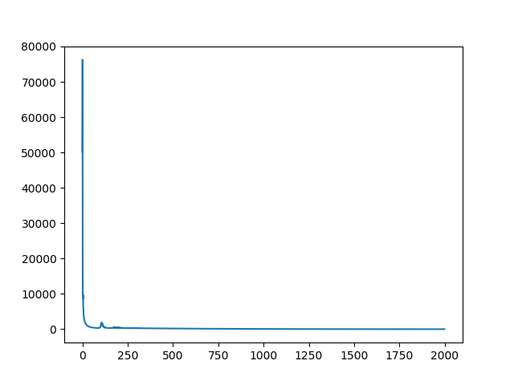

##### 前言  

&emsp;&emsp;在前面的叙述中，我们都是在二维平面上做卷积操作，并在此基础上进行了反向传播算法的推导和计算，但是，如果仅仅限于理论怕是很难验证我们算法的是否是真的可以让结果收敛，因此，这一篇文章中，我们就通过代码来验证一下算法在实际过程中的收敛情况。  

&emsp;&emsp;必须要说明的是，之前讲解的算法都是十分朴素的，具有很大的改进空间，代码的实现也是基于这种朴素的计算过程，因此，并未对算法进行优化。  

<!--more-->

##### 一、代码  
&emsp;&emsp;在代码中，我们实现了一个20x20大小的矩阵的卷积操作，并在给定的卷积核的情况下计算出了我们需要的结果，然后随机初始化卷积核，希望通过训练，让卷积的结果尽可能和在给定的卷积核的情况下一致。  

&emsp;&emsp;代码的中每一个函数的详细功能都做了注释。代码如下：  

```python
# import tensorflow as tf
import numpy as np
import matplotlib.pyplot as plt

# 学习率
learning_rate = 0.00003


def convolution(x, kernel, stride):
    """
    二维平面上的卷积，padding为VALID
    :param x: 被卷积的特征矩阵，是一个二维矩阵
    :param kernel: 卷积核参数，为一个二维矩阵
    :param stride: 步长信息，一个正整数
    :return: 卷积之后的矩阵信息
    """
    assert len(x.shape) == 2
    assert len(kernel.shape) == 2
    assert type(stride) is int

    assert (x.shape[0] - kernel.shape[0]) % stride == 0 and (x.shape[1] - kernel.shape[1]) % stride == 0

    result = np.zeros([(x.shape[0] - kernel.shape[0]) // stride + 1, (x.shape[1] - kernel.shape[1]) // stride + 1])

    for i in range(0, x.shape[0] - kernel.shape[0] + 1, stride):
        for j in range(0, x.shape[1] - kernel.shape[1] + 1, stride):
            sum = 0
            for p in range(kernel.shape[0]):
                for k in range(kernel.shape[1]):
                    sum += x[i + p][j + k] * kernel[p][k]
            result[i // stride][j // stride] = sum
    return result


# 对矩阵的上下左右分别进行填补0的操作。
def padding_zeros(x, left_right, top_bottom):
    """
    对矩阵的外围进行填补0的操作。
    :param x: 一个二维矩阵
    :param left_right: 一个长度为2的数组，分别表示左侧和右侧需要填补的0的层数
    :param top_bottom: 一个长度为2的数组，分别表示上侧和下侧需要填补的0的层数
    :return: 填补之后的矩阵
    """

    assert len(x.shape) == 2
    assert len(left_right) == 2 and len(top_bottom) == 2
    new_x = np.zeros([top_bottom[0] + top_bottom[1] + x.shape[0], left_right[0] + left_right[1] + x.shape[1]])
    new_x[top_bottom[0]: top_bottom[0] + x.shape[0], left_right[0]: left_right[0] + x.shape[1]] = x
    return new_x


def insert_zeros(x, stride):
    """
    在矩阵的每两个相邻元素之间插入一定数目的0
    :param x: 一个二维矩阵
    :param stride: 一个非负数
    :return: 插入0之后的矩阵
    """
    assert len(x.shape) == 2
    assert type(stride) is int and stride >= 0
    new_x = np.zeros([(x.shape[0] - 1) * stride + x.shape[0], (x.shape[1] - 1) * stride + x.shape[1]])

    for i in range(x.shape[0]):
        for j in range(x.shape[1]):
            new_x[i * (stride + 1)][j * (stride + 1)] = x[i][j]

    return new_x


def rotate_180_degree(x):
    """
    将矩阵旋转180°，这一步主要是针对卷积核而言。
    :param x: 需要被旋转的矩阵
    :return: 旋转之后的矩阵
    """

    assert len(x.shape) == 2
    return np.rot90(np.rot90(x))


class conv(object):
    def __init__(self, kernel, stride=1, bias=None):
        """
        表示卷积的类
        :param kernel: 卷积核参数，可以是一个整数，表示卷积核尺寸，也可以是一个二维的矩阵。
        :param stride: 一个正整数，表示步长信息
        :param bias: 偏置量，一个浮点数
        """
        if type(kernel) is int:
            self.kernel = np.random.normal(0, 1, [kernel, kernel])
            self.kernel_size = kernel
        elif type(kernel) is np.ndarray and len(kernel.shape) == 2:
            assert kernel.shape[0] == kernel.shape[1]
            self.kernel = kernel
            self.kernel_size = kernel.shape[0]

        self.bias = np.random.normal(0, 1) if bias is None else bias
        self.stride = stride

        self.x = None

    def forward(self, x):
        """
        前向传播的计算
        :param x: 输入矩阵，是一个二维矩阵
        :return: 经过卷积并加上偏置量之后的结果
        """
        self.x = x
        return convolution(x, self.kernel, stride=self.stride) + self.bias

    def backward(self, error):
        """
        卷积的反向传播过程
        :param error: 接收到的上一层传递来的误差矩阵
        :return: 应该传递给下一层的误差矩阵
        """
        # 首先在矩阵的每两个元素之间插入合适数目的0
        error_inserted = insert_zeros(error, stride=self.stride - 1)

        # 在上面的矩阵外围填补上合适数目的0
        error_ = padding_zeros(error_inserted,
                               [self.kernel_size - 1, self.kernel_size - 1],
                               [self.kernel_size - 1, self.kernel_size - 1])

        # 将卷积核旋转180°
        kernel = self.kernel.copy()
        kernel = rotate_180_degree(kernel)

        # 将上面的两个矩阵进行卷积操作，步长为1，求得需要传递给下一层的误差矩阵
        error_ = convolution(error_, kernel, 1)

        # 参数更新
        # 将输入矩阵和插入0的矩阵进行步长为1的卷积，得到卷积核的更新梯度
        kernel_gradient = convolution(self.x, error_inserted, 1)

        # 将误差矩阵中每个元素相加得到偏置量的更新梯度
        bias_gradient = np.sum(error_inserted)

        # 利用学习率更新参数
        self.kernel -= kernel_gradient * learning_rate
        self.bias -= bias_gradient * learning_rate

        # 返回误差矩阵
        return error_


class sigmoid(object):
    def __init__(self):
        self.x = None

    def forward(self, x):
        self.x = x
        return 1.0/(1.0+np.exp(self.x))

    def backward(self, error):
        s = 1.0/(1.0+np.exp(self.x))
        return error * s * (1 - s)


class relu(object):
    def __init__(self):
        self.x = None

    def forward(self, x):
        self.x = x
        return np.maximum(x, 0)

    def backward(self, error):
        return error * (self.x > 0)


if __name__ == '__main__':
    map = np.random.normal(1, 1, (20, 20))
    print("*"*30)
    print("feature map:")
    print(np.round(map, 3))

    kernel1 = np.array([[0, 0, 1], [0, 2, 0], [1, 0, 1]], dtype=np.float32)
    kernel2 = np.array([[1, 0, 0, 1], [1, 0, 0, 1], [0, -1, -1, 0], [0, 1, 1, 0]], dtype=np.float32)

    print("*"*30)
    print("kernel 1:\n", kernel1)
    print("*" * 30)
    print("kernel 2:\n", kernel2)

    # 这里我们建立两层卷积，卷积核为给定的数值：kernel1和kernel2
    conv1 = conv(kernel1, 1, 0)
    map1 = conv1.forward(map)
    conv2 = conv(kernel2, 2, 0)
    target = conv2.forward(map1)

    print("*"*30)
    print("our target feature:\n", np.round(target, 3))

    # 建立同样的两层网络，只不过卷积核为随机产生的数值
    print("\nBuilding our model...")
    conv1 = conv(3, 1, 0)
    map1 = conv1.forward(map)
    conv2 = conv(4, 2, 0)
    map2 = conv2.forward(map1)

    loss_collection = []
    print("\nStart training ...")
    for loop in range(2000):
        # 损失值我们使用简单的差平方和来计算。
        loss_value = np.sum(np.square(map2 - target))
        loss_collection.append(loss_value)
        if loop % 100 == 99:
            print(loop, ": ", loss_value)

        # 根据损失函数得到最末端的误差矩阵，并逐级向前传递
        error_ = 2 * (map2 - target)
        error_ = conv2.backward(error_)
        error_ = conv1.backward(error_)

        # 参数更新之后需要重新进行正向传播，以获得新的输出矩阵
        map1 = conv1.forward(map)
        map2 = conv2.forward(map1)

    print("*"*30)
    print("Our reconstructed map:")
    print(map2)

    plt.plot(np.arange(len(loss_collection)), loss_collection)
    plt.show()

```

##### 二、结果  

&emsp;&emsp;代码运行如下：  

```text
******************************
feature map:
[[-1.493e+00  1.429e+00  4.150e-01  2.294e+00  9.450e-01  1.043e+00
   1.115e+00  1.470e+00  1.999e+00  8.890e-01 -1.190e-01  2.020e-01
   2.630e-01  1.916e+00  1.292e+00  8.600e-02  2.161e+00  1.212e+00
   1.296e+00  3.067e+00]
 [-9.290e-01  4.850e-01  1.980e+00  2.666e+00  1.507e+00  2.475e+00
   7.210e-01  6.480e-01  8.730e-01  2.068e+00 -8.910e-01  7.600e-01
   4.270e-01  5.770e-01  5.800e-01  7.930e-01  1.076e+00  1.472e+00
   2.294e+00  1.200e-01]
 [ 1.356e+00 -8.810e-01  1.626e+00 -6.420e-01  4.580e-01  4.310e-01
   1.639e+00  5.760e-01  1.101e+00 -1.714e+00  1.070e-01  1.200e+00
   1.862e+00 -2.820e-01  2.282e+00  1.285e+00  2.940e-01  8.400e-01
   3.070e-01  9.910e-01]
 [ 4.910e-01  3.052e+00  4.760e-01  7.610e-01  1.366e+00  1.263e+00
   2.353e+00 -2.200e-02 -5.740e-01  2.357e+00  2.029e+00  1.604e+00
  -2.630e-01  7.030e-01  1.383e+00  1.858e+00  1.831e+00  2.824e+00
   9.800e-01  2.470e+00]
 [ 1.521e+00  3.700e-01  7.260e-01  3.117e+00 -7.180e-01  1.144e+00
   1.514e+00  1.212e+00  1.540e+00  1.202e+00  1.326e+00  9.830e-01
   7.290e-01  2.144e+00  1.885e+00  3.084e+00  7.270e-01  1.983e+00
   1.162e+00  6.660e-01]
 [ 1.758e+00  1.107e+00  2.234e+00  3.171e+00  1.200e+00  1.257e+00
   1.659e+00  1.835e+00 -1.299e+00  1.283e+00  1.034e+00  4.140e-01
   1.478e+00  1.042e+00  3.028e+00  9.400e-01  2.014e+00 -9.420e-01
   1.578e+00 -4.270e-01]
 [ 3.420e-01 -9.200e-02  1.097e+00 -1.641e+00  3.155e+00  2.114e+00
   8.570e-01  9.910e-01  1.147e+00  1.006e+00  1.065e+00 -4.620e-01
   1.560e+00  1.895e+00 -8.060e-01  7.630e-01  3.091e+00  1.262e+00
  -1.840e-01  1.220e-01]
 [ 3.828e+00  2.010e+00  2.188e+00  6.040e-01  1.420e+00  9.900e-02
   1.033e+00  7.460e-01  2.611e+00  1.258e+00  9.510e-01  9.210e-01
   7.440e-01  7.300e-01  2.780e-01  1.717e+00  2.000e-01  1.595e+00
   1.389e+00  1.656e+00]
 [ 3.350e-01  8.200e-01  3.018e+00  1.879e+00 -2.100e-02 -6.250e-01
   1.573e+00  6.390e-01  1.452e+00 -4.680e-01  1.200e+00  1.833e+00
   1.526e+00  1.907e+00  1.785e+00  2.051e+00  8.190e-01  1.600e-01
   2.093e+00  9.290e-01]
 [ 9.590e-01 -1.270e-01  2.545e+00  1.877e+00  1.014e+00  5.830e-01
   1.600e+00  1.722e+00  1.240e-01  1.378e+00  1.370e-01  1.201e+00
   6.540e-01  6.960e-01  1.701e+00 -8.420e-01  1.627e+00 -1.674e+00
  -7.400e-02  1.127e+00]
 [ 7.030e-01  3.290e-01  1.841e+00  1.385e+00  3.680e-01  1.174e+00
   1.875e+00  8.580e-01  8.540e-01  1.696e+00 -2.330e-01 -8.310e-01
   1.079e+00  1.012e+00  5.040e-01  1.632e+00  2.550e-01 -2.090e-01
   8.530e-01 -5.290e-01]
 [ 4.100e-01  1.175e+00  1.506e+00 -8.640e-01  1.488e+00  1.113e+00
   7.790e-01  8.280e-01  1.074e+00 -5.560e-01 -2.760e-01  2.561e+00
   1.135e+00  1.375e+00 -8.140e-01 -8.700e-02 -1.120e-01  5.220e-01
  -8.720e-01  5.610e-01]
 [ 1.845e+00  1.736e+00 -3.690e-01  1.212e+00  1.269e+00  1.774e+00
  -1.240e+00 -3.770e-01  4.360e-01  9.160e-01  2.761e+00 -1.470e-01
   1.095e+00  3.250e-01 -2.150e-01 -2.332e+00  9.290e-01  1.240e+00
   5.680e-01  1.836e+00]
 [-4.660e-01  6.710e-01  1.191e+00  2.862e+00  3.050e-01  1.861e+00
   4.020e-01  1.327e+00  7.300e-01  6.270e-01  2.682e+00  3.048e+00
   3.630e-01 -3.140e-01 -3.890e-01  2.380e+00 -5.500e-01  1.491e+00
   3.220e-01  4.970e-01]
 [ 7.290e-01  2.541e+00  1.011e+00 -3.260e-01  1.789e+00  6.700e-02
   3.560e-01  1.883e+00  2.602e+00  4.550e-01  1.768e+00  3.350e-01
   1.590e-01  2.364e+00  3.659e+00  7.420e-01  2.127e+00  2.639e+00
   5.050e-01  3.774e+00]
 [ 2.620e+00 -5.000e-03  1.250e+00  1.045e+00  1.090e+00  1.300e-02
   1.816e+00  1.499e+00 -6.680e-01  1.314e+00  5.150e-01  1.111e+00
   4.190e-01  1.564e+00  1.990e+00  3.700e-01 -2.270e-01  2.090e-01
   1.865e+00 -8.290e-01]
 [-8.800e-02  2.931e+00  9.130e-01  4.410e-01 -2.790e-01  2.880e-01
  -2.830e-01  1.576e+00  1.374e+00  1.437e+00  7.210e-01  2.540e-01
   7.540e-01  7.900e-02  8.110e-01  2.291e+00  4.300e-02  1.173e+00
   2.160e-01  1.258e+00]
 [ 6.200e-01 -7.400e-02 -6.030e-01 -2.650e-01  6.640e-01  2.018e+00
  -1.574e+00  2.530e-01  1.260e+00  8.890e-01 -2.350e-01  1.029e+00
   1.000e-03  2.490e-01  1.300e-02  7.250e-01  1.890e-01  2.984e+00
   9.790e-01  9.130e-01]
 [ 1.443e+00  3.438e+00  8.000e-01  3.240e-01  8.100e-01  4.750e-01
   1.041e+00  5.130e-01  1.329e+00 -4.180e-01  2.237e+00  3.070e-01
   1.488e+00  1.637e+00 -2.300e-01  1.642e+00  2.034e+00 -9.670e-01
   1.079e+00  1.006e+00]
 [ 2.653e+00  4.840e-01  4.790e-01 -1.493e+00  4.030e-01 -5.900e-02
   3.610e-01 -9.410e-01 -6.060e-01  2.276e+00  4.180e+00  3.480e-01
  -4.930e-01  1.783e+00 -4.270e-01  1.799e+00  2.069e+00  1.685e+00
   1.172e+00  1.912e+00]]
******************************
kernel 1:
 [[0. 0. 1.]
 [0. 2. 0.]
 [1. 0. 1.]]
******************************
kernel 2:
 [[ 1.  0.  0.  1.]
 [ 1.  0.  0.  1.]
 [ 0. -1. -1.  0.]
 [ 0.  1.  1.  0.]]
******************************
our target feature:
 [[26.553 18.88  18.124 18.16   8.258 23.685 24.708 24.097]
 [20.64  31.311 14.439 25.2   16.984 30.628 19.429 32.712]
 [29.07  19.528 25.637 14.765 27.227 21.041 27.518 10.76 ]
 [22.549 24.207 16.272 20.756 14.157 24.426 12.429 19.15 ]
 [16.412 28.147 14.357 18.035 25.29  12.691  9.955 13.582]
 [19.198 13.485 16.587 13.285 12.428 16.192 11.528  3.429]
 [15.984 17.609 12.73  27.705 16.503 17.337 16.276 26.504]
 [11.86  11.337  8.349 13.658 25.007 17.74  20.237 23.013]]

Building our model...

Start training ...
99 :  641.0993619453625
199 :  428.8371676892213
299 :  297.4697981028265
399 :  233.14519479024102
499 :  192.98557066294234
599 :  162.86663169198815
699 :  135.89478966699724
799 :  112.77961888797242
899 :  92.23756791064116
999 :  74.44662107474497
1099 :  59.206416473465296
1199 :  46.57649424446782
1299 :  36.503166007020035
1399 :  28.75377812512617
1499 :  22.91409697399721
1599 :  18.484425911815908
1699 :  15.025851820178637
1799 :  12.234261363137719
1899 :  9.92859528317586
1999 :  8.00538026504608
******************************
Our reconstructed map:
[[26.03217516 18.57601188 17.6417854  17.74106052  8.00899738 23.45962739
  24.25683639 23.52688692]
 [20.34532322 30.86283096 14.08412555 24.79283798 16.8623232  30.0709141
  19.06563574 32.19093566]
 [28.79064215 18.94645701 25.26600894 14.3734212  26.84098616 20.56125496
  27.22489939 10.43946569]
 [22.32314845 23.72247534 15.95624896 20.26777129 13.74630188 24.21656068
  12.33211161 18.89299591]
 [16.02570137 27.59958699 14.17716638 17.78058347 25.12238011 12.49517613
   9.7392468  13.45919031]
 [18.80339915 13.04877141 16.39073949 12.79776179 11.97347116 15.91895708
  11.3292454   3.33631504]
 [15.67305314 17.20668751 12.43561879 27.23227887 16.12905207 17.00011351
  15.94369672 26.2171221 ]
 [11.53226582 11.37091115  8.17071381 13.7191314  24.74154248 17.43440331
  19.80145666 22.61327712]]
```

&emsp;&emsp;从上面的结果可以看出，我们经过训练之后得到的重建之后的输出矩阵和原始的目标矩阵已经十分接近。  

&emsp;&emsp;在训练过程中的loss值绘制成折线图如下：  



&emsp;&emsp;可以看出，损失值loss在某些地方会存在一些小的波动，但在整体上，损失值loss是处在一直在减小的过程中的，这说明我们的算法是正确的。   

