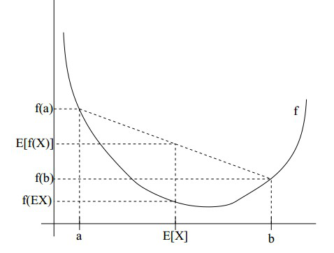

##### 前言  

&emsp;&emsp;EM算法是一种可以求解含有隐变量的迭代算法，当我们在实际过程中收集数据的时候，并不一定会收集全部的有效信息。比如，当我们想统计全校学生的身高分布的时候，可以将全校学生的身高看作是一个正态分布，但是毕竟男生和女生之间身高的分布还是有些不同的，但是万一我们没有对性别信息进行统计，而只是统计了身高信息的话，求得的概率分布的参数肯定会有较大的误差，这个时候，我们就需要将每一个样本的性别分布也考虑进去，从而希望获得更准确的概率分布估计。

<!-- more --> 

##### 一、准备工作

######  1、极大似然估计  

&emsp;&emsp;极大似然估计我们并不陌生，在逻辑回归的求解过程中，我们就是用了极大似然估计，现在还是简单说明一下。  

&emsp;&emsp;假设我们现在有一个概率分布，不妨记作$P(x;\theta)​$，其中，$\theta​$是未知参数，有可能是一个数值，也有可能是多个数值组成的参数向量，$x​$表示输入样本。现在我们想通过抽样的方式对参数$\theta​$进行估计。假设我们一共采集了$N​$组数据，为$\{x_1, x_2, \cdots, x_N\}​$。那么样本的联合概率函数可以表示为关于$\theta​$的函数，即：
$$
L(\theta) = L(x_1, x_2, \cdots, x_N;\theta) = \prod_i^N P(x_i;\theta)
$$
&emsp;&emsp;$L(\theta)​$是参数 $θ​$ 的函数，随着 $θ​$ 在参数变化，$L​$函数也在变化。而极大似然估计目的就是在样本$\{x_1,...,x_N\}​$固定的情况下，寻找最优的 $θ​$ 来极大化似然函数：
$$
\theta^{*} = \mathop{\arg\max}_{\theta}{L(\theta)}
$$
&emsp;&emsp;上式在数学领域，可以看作是对 $θ^{*}$求解，求$L(θ)$ 函数的极值点，导数为0处，即为 $θ*$ 的点。

&emsp;&emsp;又因为$L(θ)​$ 和 $ln(θ)​$ 在同一个 $θ​$ 处取得极值，我们可以对 $L(θ)​$ 取对数，将连乘转化为连加(方便求导)，得到对数化似然函数：
$$
\theta^*= \mathop{\arg\max}_{\theta}{ln\;L(\theta)} = \mathop{\arg\max}_{\theta} \sum_i ln\; P(x_i;\theta)
$$

######  2、Jensen不等式   

&emsp;&emsp;下图是一张描述Jensen不等式十分经典的图。

&emsp;&emsp;如果一个函数$f(x)$在其定义域内是一个连续函数，且其二阶导数恒小于等于0，我们称该函数在其定义域上是凹函数，反之，如果二阶导数恒大于等于0，我们称该函数在其定义域上是凸函数。

&emsp;&emsp;如果$f(x)$是一个凸函数，那么在其定义域上我们有:
$$
E(f(X)) \geq f(E(X))
$$
&emsp;&emsp;反之，如果$f(x)$是一个凹函数，在其定义域上我们有：
$$
E(f(X)) \leq f(E(X))
$$
&emsp;&emsp;其中，$E$表示对变量取期望。上面两个不等式当且仅当$X$是一个常量时可以取等号。

######  3、边缘分布  

&emsp;&emsp;假设我们有两个随机变量，那么我们通过抽样，就会获得一个二维的联合概率分布$P(X=x_i,Y=y_j)$。

&emsp;&emsp;对每一个$X=x_i$，对其所有的$Y$进行求和操作，我们有：
$$
\sum_{y_j}P(X=x_i, Y=y_j) = P(X=x_i)
$$
&emsp;&emsp;将上面的式子称之为$X=x_i$的边际分布（边缘分布）。

​	有了以上的一些基础准备，我们就可以来推导EM算法了。

##### 二、EM算法  

&emsp;&emsp;假设我们的数据集为：
$$
D = \{x^{(1)}, x^{(2)}, \cdots, x^{(N)}\}
$$

&emsp;&emsp;其中 $x^{(i)}​$ 是每一个具体的输出实例，表示每一次独立实验的结果，$N​$表示独立实验的次数。  

&emsp;&emsp;我们设样本的概率分布函数为$P(x^{(i)};\theta)​$，其中$\theta​$是模型中的待估参数，可以是一个变量，也可以是多个变量所组成的参数向量。  

&emsp;&emsp;根据极大似然估计，我们有：
$$
L(\theta) = \prod_{i}P(x^{(i)}; \theta) \quad 1 \leq i \leq N \tag{1}
$$
&emsp;&emsp;两边同时取对数：
$$
ln\;L(\theta) = \sum_{i} ln \; P(x^{(i)}; \theta) \quad 1 \leq i \leq N \tag{2}
$$
&emsp;&emsp;此时，我们可以将 $P(x^{(i)}; \theta)$看作是关于隐变量的一个边缘分布，即（我们假设隐变量为$Z$）：
$$
ln \; L(\theta) = \sum_i ln \; \sum_{z^{(i)}} P(x^{(i)}, z^{(i)}; \theta) \quad 1 \leq i \leq N \tag{3}
$$
&emsp;&emsp;这里我们利用了边缘分布的相关等式，即：
$$
P(x^{(i)}; \theta) = \sum_{z^{(i)}} P(x^{(i)}, z^{(i)}; \theta)
$$
&emsp;&emsp;在上面的式子中，$z​$是一个隐藏变量，必然也会满足一个特定的概率分布，我们不妨把这个分布记作$Q_{i}(z^{(i)})​$，显然，我们有$\sum_{z^{(i)}} Q_i(z^{(i)}) = 1​$。这里的下标和上标$i​$表示的是第$i​$个样本。故我们将上式改写成：
$$
\begin{aligned}
ln \; L(\theta) &=& \sum_i ln \sum_{z^{(i)}} P(x^{(i)}, z^{(i)}; \theta) \\
&=& \sum_i ln \sum_{z^{(i)}} Q_i(z^{(i)}) \cdot \frac{P(x^{(i)}, z^{(i)}; \theta)}{Q_i(z^{(i)})} 
\end{aligned} \tag{4}
$$
&emsp;&emsp;现在，我们把如下的部分单独拿出来：
$$
Q_i(z^{(i)}) = p(z^{(i)}) \\
\frac{P(x^{(i)}, z^{(i)}; \theta)}{Q_i(z^{(i)})} = f(z^{(i)})
$$
&emsp;&emsp;很显然，我们有$\sum_{z^{(i)}} Q_i(z^{(i)}) = \sum_i p(z^{(i)}) = 1$，所以，我们可以将上式写成：
$$
ln \; L(\theta) = \sum_i ln \sum_{z^{(i)}} p(z^{(i)}) f(z^{(i)}) \tag{5}
$$
&emsp;&emsp;可以看出，我们的$\sum_{z^{(i)}} p(z^{(i)}) f(z^{(i)})$实际上实在对$f(z^{(i)})$计算期望，其中$p(z^{(i)})$是函数$f(z^{(i)})$的概率分布函数，于是，我们可以把上面的式子记作：
$$
E[f(z^{(i)})] = \sum_{z^{(i)}} Q_i(z^{(i)}) \cdot \frac{P(x^{(i)}, z^{(i)}; \theta)}{Q_i(z^{(i)})} \tag{6}
$$
&emsp;&emsp;于是，我们的似然函数就变成了：
$$
ln \; L(\theta) = \sum_i ln \;(E[f(z^{(i)})]) = \sum_i ln \; (E[\frac{P(x^{(i)}, z^{(i)}; \theta)}{Q_i(z^{(i)})}]) \tag{7}
$$
&emsp;&emsp;这个时候就是Jensen不等式出场的时候了。

&emsp;&emsp;我们观察到函数$g(x)=ln(x)$，它的一阶导数是$g'(x) = \frac{1}{x}$，二阶导数是$g''(x) = - \frac{1}{x^2}$恒小于0，因此$g(x) = ln(x)$是一个凹函数，此时，我们利用Jensen不等式处理$ln \;L(\theta)$，有：
$$
\begin{aligned}
H(Y|X)& =\sum_{x\in X} p(x)H(Y|X) \\
& =-\sum_{x\in X} p(x)\sum_{y\in Y}p(y|x)\log p(y|x)\\
& =-\sum_{x\in X} \sum_{y\in Y}p(y,x)\log p(y|x)
\end{aligned}
$$
&emsp;&emsp;故：我们根据Jensen不等式，有了以下的一个重要的不等式关系：
$$
ln \; L(\theta) \geq \sum_i \sum_{z^{(i)}} Q_i(z^{(i)}) \cdot ln(\frac{P(x^{(i)}, z^{(i)}; \theta)}{Q_i(z^{(i)})})) \tag{9}
$$
&emsp;&emsp;需要注意的是，我们使用Jensen不等式的时候，是对$z^{(i)}$的分布使用的，而$\sum_i \sum_{z^{(i)}} Q_i(z^{(i)}) \cdot ln(\frac{P(x^{(i)}, z^{(i)}; \theta)}{Q_i(z^{(i)})}))$是函数$ln \; L(\theta)$的一个下界，所以实际上，$ln \; L(\theta)$包含了两个参数变量，一个是$\theta$， 一个是隐藏变量$z^{(i)}$，所以我们需要弄清楚调整$\theta$和$z^{(i)}$的区别。

&emsp;&emsp;由于Jensen不等式处理的是$z^{(i)}$，因此当我们调整$z^{(i)}$的时候，我们实际上实在调整似然函数$ln \; L(\theta)$的下界，使得似然函数$ln \; L(\theta)$的下界一点一点上升，最终于此时的似然函数$ln \; L(\theta)$的值相等。

&emsp;&emsp;然后，固定$z^{(i)}$的数值，调整$\theta$的时候，就可以将$z^{(i)}$看作是一个已知变量，这个时候就可以利用极大似然估计的方法对$\theta$参数的值进行计算，此时会得到一个新的$\theta$的值，不妨记作$\theta'$。我们这个时候再根据这个新的$\theta'$的值，重新调整$z^{(i)}$，使得函数的下界一点一点上升，达到和$ln \; L(\theta)$相同之后，再固定$z^{(i)}$，更新$\theta$的值。一直重复以上过程，直到似然函数收敛到某一个极大值$\theta^*$处。

&emsp;&emsp;下图是一个很经典的关于EM算法的迭代过程示意图。（图片来自网络）

&emsp;&emsp;在上面的求解过程中，只有当此时的函数下界等于当前$\theta$的对数似然函数时，才能保证当我们优化了这个下界的时候，才真正优化了目标似然函数。
$$
ln \; L(\theta) \geq \sum_i \sum_{z^{(i)}} Q_i(z^{(i)}) \cdot ln(\frac{P(x^{(i)}, z^{(i)}; \theta)}{Q_i(z^{(i)})})) \tag{10}
$$
&emsp;&emsp;在优化迭代的过程中，我们通过固定$\theta​$并调整$z^{(i)}​$的可能分布，使得等式成立，即达到$ln \; L(\theta)​$的下界。根据Jensen不等式的条件，当$f(x)​$是一个凹函数的时候，有$f(E[X]) \geq E[f(X)]​$，欲使等号成立，$X​$需要是一个常量。那么，在上面的式子中，我们有$X = \frac{P(x^{(i)}, z^{(i)}; \theta)}{Q_i(z^{(i)})}​$，故此时我们需要将$\frac{P(x^{(i)}, z^{(i)}; \theta)}{Q_i(z^{(i)})})​$看作一个常数，不妨我们设这个常数为$C​$，于是我们有：
$$
\frac{P(x^{(i)}, z^{(i)}; \theta)}{Q_i(z^{(i)})}) = C \tag{11}
$$
$$
P(x^{(i)}, z^{(i)}; \theta) = C Q_i(z^{(i)})
$$
$$
\sum_{z^{(i)}} P(x^{(i)}, z^{(i)}; \theta) = C \sum_{z^{(i)}} Q_i(z^{(i)}) \tag{12}
$$
&emsp;&emsp;考虑到$Q_i(z^{(i)})$实际上是隐变量$z^{(i)}$的一个概率分布，满足：
$$
\sum_{z^{(i)}} Q_i(z^{(i)}) = 1 ,\quad Q_i(z^{(i)}) \geq 0
$$
&emsp;&emsp;于是，我们将$\sum_{z^{(i)}} Q_i(z^{(i)}) = 1$代入到上面的式子(12)中，有：
$$
\sum_{z^{(i)}} P(x^{(i)}, z^{(i)}; \theta) = C \tag{11}
$$
&emsp;&emsp;再将$C$带入到公式(11)中，我们有：
$$
\frac{P(x^{(i)}, z^{(i)}; \theta)}{Q_i(z^{(i)})} = C = \sum_{z^{(i)}} P(x^{(i)}, z^{(i)}; \theta)
$$

$$
\begin{aligned}
Q_i(z^{(i)}) &= \frac{P(x^{(i)}, z^{(i)};\theta)}{\sum_{z^{(i)}} P(x^{(i)}, z^{(i)}; \theta)} \\
&= \frac{P(x^{(i)}, z^{(i)};\theta)}{P(x^{(i)};\theta)} \\
&= P(z^{(i)}|x^{(i)};\theta)
\end{aligned} \tag{12}
$$

&emsp;&emsp;&emsp;即我们可以得到$Q_i(z^{(i)})$的值，也即我们得到$P(z^{(i)}|x^{(i)};\theta)$的值，表示在当前的模型参数$\theta$为定值时，在给定的$x^{(i)}$的条件下，得到$z^{(i)}$的概率大小。

&emsp;&emsp;&emsp;至此，我们的EM算法的大部分情况进行了说明。首先，我们会对模型的参数$\theta$ 进行随机初始化，不妨记作$\theta^0$。然后会在每一次的迭代循环中计算$z^{(i)}$的条件概率期望，这就是EM算法中的”E步“。最后再根据计算得到的概率分布，根据极大似然的方法计算在当前隐藏变量分布下的使得似然函数取得极大的$\theta$的值，并进行更新，这就是EM算法中的”M步“。  

&emsp;&emsp;观察到在”M步“中，我们有：
$$
ln \; L(\theta) = \sum_i \sum_{z^{(i)}} Q_i(z^{(i)}) \cdot ln(\frac{P(x^{(i)}, z^{(i)}; \theta)}{Q_i(z^{(i)})}))
$$

$$
\theta^{(j + 1)} = \mathop{\arg\max}_{\theta}\sum_i \sum_{z^{(i)}} Q_i(z^{(i)}) ln (P(x^{(i)}, z^{(i)};\theta)) - \sum_i \sum_{z^{(i)}} Q_i(z^{(i)})ln(Q_i(z^{(i)}))
$$

&emsp;&emsp;观察到在上面的式子中，$\sum_i \sum_{z^{(i)}} Q_i(z^{(i)})ln(Q_i(z^{(i)}))$对于整个优化的过程来说相当于是一个常数项，因此可以省略，于是，上式可以简写成：
$$
\begin{aligned}
\theta^{(j + 1)} &= \mathop{\arg\max}_{\theta}\sum_i \sum_{z^{(i)}} Q_i(z^{(i)}) ln (P(x^{(i)}, z^{(i)};\theta)) \\
&=  \mathop{\arg\max}_{\theta}\sum_i \sum_{z^{(i)}} P(z^{(i)}|x^{(i)};\theta^{(j)}) ln (P(x^{(i)}, z^{(i)};\theta))
\end{aligned} \tag{13}
$$
&emsp;&emsp;公式(13)内部的$\sum_i \sum_{z^{(i)}} P(z^{(i)}|x^{(i)};\theta^{(j)}) ln (P(x^{(i)}, z^{(i)};\theta))$就是EM算法的核心，我们一般将其称之为**Q函数**，通常记为：$Q(\theta, \theta^{(j)})$。

&emsp;&emsp;所以，我们的**EM算法可以总结如下**：

1. 数据集为$D = \{x^{(1)}, x^{(2)}, \cdots, x^{(N)}\}$ ，随机初始化模型参数$\theta$，记作$\theta^{(0)}$。

2. 对每一次迭代循环，$j = 0, 1, 2, 3, \cdots, M​$，我们有：

	1. E步（E-Step）：在当前的模型参数$\theta^{(j)}​$的条件下，计算联合分布的条件概率期望：  
$$
Q_i(z^{(i)}) = P(z^{(i)}|x^{(i)};\theta^{(j)})
$$

	2.  M步（M-Step）：在计算出条件概率分布的期望的基础上，极大化似然函数，得到新的模型参数的值$\theta^{(j+1)}​$:  
$$
\theta^{(j+1)} = \mathop{\arg\max}_{\theta}\sum_i \sum_{z^{(i)}} P(z^{(i)}|x^{(i)};\theta^{(j)}) ln (P(x^{(i)}, z^{(i)};\theta))
$$

3. 如果$\theta^{(j+1)}​$已经收敛，则跳出循环结束：

4. 输出最后模型参数$\theta​$的值。

##### 三、EM算法解决三硬币模型  

&emsp;&emsp;三硬币模型是EM算法的一个简单使用，问题请参考《统计学习方法》一书。

&emsp;&emsp;假设有三枚质量分布不均匀的硬币A、B、C，这些硬币正面出现的概率分别是$\pi$、$p$、$q$。进行如下掷硬币试验： 先掷A，如果A是正面则再掷B，如果A是反面则再掷C。对于B或C的结果，如果是正面则记为1，如果是反面则记为0。进行N次独立重复实验，得到结果。现在只能观测到结果，不能观测到掷硬币的过程，估计模型参数$\theta=(\pi,p,q)​$。 

&emsp;&emsp;由于实验一共进行了N次，每一次都是独立重复实验，那么我们可以将实验结果记录如下，其中每一次的实验结果是已知的：
$$
X = \{x^{(1)}, x^{(2)}, \cdots, x^{(N)}\} \quad x^{(i)} \in \{0, 1\}
$$
&emsp;&emsp;每次独立实验都会产生一个隐藏变量$z^{(i)}$，这个隐藏变量是无法被观测到的，我们可以将其记录如下，这个隐藏变量的记录结果是未知的：
$$
Z = \{z^{(1)}, z^{(2)}, \cdots, z^{(N)}\} \quad z^{(i)} \in \{0, 1\}
$$
&emsp;&emsp;对于第$i$次的独立重复实验，我们有：
$$
P(x^{(i)} = 0;\theta) = \pi(1-p)^{1-x^{(i)}} + (1-\pi)(1-q)^{1-x^{(i)}}
$$

$$
P(x^{(i)}=1;\theta) = \pi p^{x^{(i)}} + (1-\pi)q^{1-x^{(i)}}
$$

&emsp;&emsp;故，综合起来看，我们有：
$$
P(x^{(i)};\theta) = \pi p^{x^{(i)}} (1-p)^{1-x^{(i)}} + (1-\pi)q^{x^{(i)}}(1-q)^{1-x^{(i)}}
$$

###### 构造极大似然函数  

&emsp;&emsp;我们可以构造我们的极大似然函数如下：
$$
\begin{aligned}
L(\theta) &= \prod_i P(x^{(i)};\theta) \\
&= \prod_i [\pi p^{x^{(i)}} (1-p)^{1-x^{(i)}} + (1-\pi)q^{x^{(i)}}(1-q)^{1-x^{(i)}}]
\end{aligned}
$$
&emsp;&emsp;两边同时取对数，有：
$$
ln \; L(\theta) = \sum_i ln\;[\pi p^{x^{(i)}} (1-p)^{1-x^{(i)}} + (1-\pi)q^{x^{(i)}}(1-q)^{1-x^{(i)}}]
$$

###### 构造我们的Q函数  

&emsp;&emsp;在没有说明的情况下，我们使用下标表示第几次迭代过程，用上标表示第几个样本，$\theta^{(j)}$的上标表示第$j$次迭代。  

&emsp;&emsp;对于三硬币问题，我们的Q函数可以构造如下：
$$
\begin{aligned}
Q(\theta, \theta^{(j)}) &= \sum_i \sum_{z^{(i)}} P(z^{(i)}|x^{(i)};\theta^{(j)}) ln (P(x^{(i)}, z^{(i)};\theta)) \\
&= \sum_i \{P(z^{(i)} =1|x^{(i)};\theta^{(j)})\cdot ln\;P(x^{(i)}, z^{(i)}=1;\theta) + P(z^{(i)} =0|x^{(i)};\theta^{(j)})\cdot ln\;P(x^{(i)}, z^{(i)}=0;\theta)\} \\
\end{aligned}
$$
&emsp;&emsp;故，我们需要求解$P(z^{(i)} =1|x^{(i)};\theta^{(j)})$，$P(x^{(i)}, z^{(i)}=1;\theta)$，$P(z^{(i)} =0|x^{(i)};\theta^{(j)})$，$P(x^{(i)}, z^{(i)}=0;\theta)$这四个概率值。  

###### 求解极大值

$$
\begin{aligned}
P(z^{(i)}=1|x^{(i)};\theta^{(j)}) &= \frac{P(x^{(i)}, z^{(i)}=1;\theta^{(j)})}{P(x^{(i)});\theta^{(j)})} \\
&= \frac{\pi_j \cdot p_j^{x^{(i)}} \cdot (1 - p_j^{(1-x^{(i)})})}{\pi_j \cdot p_j^{x^{(i)}} \cdot (1 - p_j^{(1-x^{(i)})}) + (1-\pi_j) \cdot q_j^{x^{(i)}} \cdot (1-q_j)^{1-x^{(i)}}} \\
&= \mu_j^{(i)}
\end{aligned}
$$

&emsp;&emsp;上式对于迭代过程来说是一个定值，我们使用符号$\mu_j^{(i)}$来表示，上标$(i)$表示的是第$i$个样本，下标$j$表示的是第$j$次迭代过程。  

&emsp;&emsp;那么很明显，我们有：
$$
\begin{aligned}
P(z^{(i)}=0|x^{(i)};\theta^{(j)}) &= \frac{P(x^{(i)}, z^{(i)}=0;\theta^{(j)})}{P(x^{(i)});\theta^{(j)})} \\
&= \frac{(1-\pi_j) \cdot q_j^{x^{(i)}} \cdot (1-q_j)^{1-x^{(j)}}}{\pi_j \cdot p_j^{x^{(i)}} \cdot (1 - p_j^{(1-x^{(i)})}) + (1-\pi_j) \cdot q_j^{x^{(i)}} \cdot (1-q_j)^{1-x^{(i)}}} \\
&= 1 - \mu_j^{(i)}
\end{aligned}
$$
&emsp;&emsp;接着，我们计算$P(x^{(i)}, z^{(i)}=1;\theta)$，$P(x^{(i)}, z^{(i)}=0;\theta)$：
$$
P(x^{(i)}, z^{(i)}=1;\theta) = \pi \cdot p^{x^{(i)}} \cdot (1-p)^{1-x^{(i)}}
$$

$$
P(x^{(i)}, z^{(i)}=0;\theta)=(1-\pi) \cdot q^{(i)}\cdot (1-q)^{1-x^{(i)}}
$$

&emsp;&emsp;我们将上面的计算结果都带入到Q函数中，有：
$$
\begin{aligned}
Q(\theta, \theta^{(j)}) &= \sum_i \sum_{z^{(i)}} P(z^{(i)}|x^{(i)};\theta^{(j)}) ln (P(x^{(i)}, z^{(i)};\theta)) \\
&= \sum_i \{P(z^{(i)} =1|x^{(i)};\theta^{(j)})\cdot ln\;P(x^{(i)}, z^{(i)}=1;\theta) + P(z^{(i)} =0|x^{(i)};\theta^{(j)})\cdot ln\;P(x^{(i)}, z^{(i)}=0;\theta)\} \\
&= \sum_i \{\mu_j^{(i)} \cdot  ln\;[\pi \cdot p^{x^{(i)}} \cdot (1-p)^{1-x^{(i)}}] + (1-\mu_j^{(i)})\cdot ln\; [(1-\pi) \cdot q^{(i)}\cdot (1-q)^{1-x^{(i)}}]\}
\end{aligned}
$$

&emsp;&emsp;下一步就是对我们需要求解的变量进行求偏导数的操作，如下：
$$
\begin{aligned}
\frac{\partial Q}{\partial \pi} &= \sum_i \{\mu_j^{(i)} \cdot \frac{p^{x^{(i)}} \cdot (1-p)^{1-x^{(i)}}}{\pi \cdot p^{x^{(i)}} \cdot (1-p)^{1-x^{(i)}}} + (1-\mu_j^{(i)})\cdot \frac{-1 \cdot q^{(i)}\cdot (1-q)^{1-x^{(i)}}}{(1-\pi) \cdot q^{(i)}\cdot (1-q)^{1-x^{(i)}}}\} \\
&= \sum_i \{\mu_j^{(i)} \cdot \frac{1}{\pi} + (\mu_j^{(i)}-1)\cdot \frac{1}{1-\pi}\} \\
&= \sum_i \{\mu_j^{(i)}(\frac{1}{\pi} + \frac{1}{1-\pi}) - \frac{1}{1-\pi} \} \\
&= \sum_i \{\mu_j^{(i)} \cdot \frac{1}{\pi(1-\pi)}\} - \frac{N\pi}{\pi(1-\pi)} \\
&= \frac{1}{\pi(1-\pi)}\{\sum_i \mu_j^{(i)} - N\pi\}
\end{aligned}
$$
&emsp;&emsp;令上式为0，我们有：
$$
\sum_i \mu_j^{(i)} - N\pi = 0
$$
&emsp;&emsp;即：
$$
\pi = \frac{1}{N} \sum_i \mu_j^{(i)}
$$
&emsp;&emsp;同样的道理，我们可以计算出Q函数相对于$p$的偏导数，如下：
$$
\begin{aligned}
\frac{\partial Q}{\partial p} &= \sum_i \mu_j^{(i)} \frac{x^{(i)} \cdot p^{x^{(i)}-1} \cdot (1-p)^{1-x^{(i)}} + p^{x^{(i)}}\cdot (1-x^{(i)})\cdot (1-p)^{-x^{(i)}}\cdot (-1)}{p^{x^{(i)}}\cdot (1-p)^{1-x^{(i)}}} + 0 \\
&= \sum_i \mu_j^{(i)} \frac{\frac{x^{(i)}}{p}\cdot p^{x^{(i)}}\cdot (1-p)^{1-x^{(i)}} + p^{x^{(i)}}\cdot (1-p)^{1-x^{(i)}} \cdot \frac{1}{1-p}\cdot (1-x^{(i)})\cdot (-1)}{p^{x^{(i)}}\cdot (1-p)^{1-x^{(i)}}} \\
&= \sum_i \mu_j^{(i)} \{\frac{x^{(i)}}{p} + \frac{1-x^{(i)}}{p-1}\} \\
&= \sum_i \mu_j^{(i)} \cdot \frac{(p-1)\cdot x^{(i)} + p(1-x^{(i)})}{p(p-1)} \\
&= \frac{1}{p(p-1)} \sum_i \mu_j^{(i)} \{p-x^{(i)}\} \\
&= \frac{1}{p(p-1)}\{p \cdot \sum_i \mu_j^{(i)} - \sum_i \mu_j^{(i)} \cdot x^{(i)}\} 
\end{aligned}
$$
&emsp;&emsp;令上式等于0，我们可以得到：
$$
p \cdot \sum_i \mu_j^{(i)} - \sum_i \mu_j^{(i)} \cdot x^{(i)} = 0
$$
&emsp;&emsp;即：
$$
p = \frac{\sum_i \mu_j^{(i)\cdot x^{(i)}}}{\sum_i \mu_j^{(i)}}
$$
&emsp;&emsp;同理，我们对$q$求偏导数，有：
$$
\begin{aligned}
\frac{\partial Q}{\partial q} &= \sum_i (1-\mu_j^{(i)})(\frac{x^{(i)}}{q}+\frac{1-x^{(i)}}{p-1}) \\
&= \sum_i (1-\mu_j^{(i)})\frac{q-x^{(i)}}{q(q-1)} \\
&= \frac{1}{q(q-1)}\{q\cdot \sum_i (1-\mu_j^{(i)}) - \sum_i (1-\mu_j^{(i)})x^{(i)}    \}
\end{aligned}
$$
&emsp;&emsp;令上式等于0，我们有：
$$
q\cdot \sum_i (1-\mu_j^{(i)}) - \sum_i (1-\mu_j^{(i)})x^{(i)} =0
$$
&emsp;&emsp;即：
$$
q = \frac{\sum_i (1-\mu_j^{(i)})x^{(i)}}{\sum_i (1-\mu_j^{(i)})}
$$
&emsp;&emsp;所以，以上就是我们解决三硬币模型的迭代公式的求解过程，公式汇总如下，这里加入了下标，表示新的一轮迭代变量：
$$
\mu_j^{(i)} = \frac{\pi_j \cdot p_j^{x^{(i)}} \cdot (1 - p_j^{(1-x^{(i)})})}{\pi_j \cdot p_j^{x^{(i)}} \cdot (1 - p_j^{(1-x^{(i)})}) + (1-\pi_j) \cdot q_j^{x^{(i)}} \cdot (1-q_j)^{1-x^{(i)}}}
$$

$$
\pi_{j+1} = \frac{1}{N} \sum_i \mu_j^{(i)}
$$

$$
p_{j+1}  = \frac{\sum_i \mu_j^{(i)\cdot x^{(i)}}}{\sum_i \mu_j^{(i)}}
$$

$$
q_{j+1}  = \frac{\sum_i (1-\mu_j^{(i)})x^{(i)}}{\sum_i (1-\mu_j^{(i)})}
$$

##### 四、EM算法的收敛性  

&emsp;&emsp;在之前的过程中，我们都是默认EM算法可以收敛到某一极大值附近，但是并没有给出十分严格的证明，所以，我们需要对EM的收敛性进行一定的验证。  

&emsp;&emsp;由于我们是利用极大似然估计来估计参数的值，那么，我们只需要保证在每一次的迭代过程中，似然函数的数值都在上升即可，即下面的不等式成立：
$$
ln \; L(\theta^{(j+1)}) \geq ln\;L(\theta^{(j)})
$$
&emsp;&emsp;由于：
$$
P(x^{(i)};\theta) = \frac{P(x^{(i)}, z^{(i)};\theta)}{P(z^{(i)}|x^{(i)};\theta)}
$$
&emsp;&emsp;因此，两边取对数，我们有：
$$
ln \; P(x^{(i)};\theta) = ln\; P(x^{(i)}, z^{(i)};\theta) - ln\;P(z^{(i)}|x^{(i)};\theta)
$$
&emsp;&emsp;对每一个样本进行累加，我们有：
$$
\sum_i ln \; P(x^{(i)};\theta) = \sum_i (ln\; P(x^{(i)}, z^{(i)};\theta) - ln\;P(z^{(i)}|x^{(i)};\theta))
$$
&emsp;&emsp;根据我们构造的Q函数，我们有：
$$
Q(\theta, \theta^{(j)}) = \sum_i \sum_{z^{(i)}} P(z^{(i)}|x^{(i)};\theta^{(j)}) ln (P(x^{(i)}, z^{(i)};\theta))
$$
&emsp;&emsp;另，我们可以构造如下的一个函数，记作$H(\theta, \theta^{(j)})$，如下：
$$
H(\theta, \theta^{(j)}) = \sum_i \sum_{z^{(i)}} P(z^{(i)}|x^{(i)};\theta^{(j)}) ln (P(z^{(i)}| x^{(i)};\theta))
$$
&emsp;&emsp;我们将上面的两个函数相减，有：
$$
\begin{aligned}
Q(\theta, \theta^{(j)}) - H(\theta, \theta^{(j)}) &=  \sum_i \sum_{z^{(i)}} P(z^{(i)}|x^{(i)};\theta^{(j)}) ln (P(x^{(i)}, z^{(i)};\theta)) \\&\quad- \sum_i \sum_{z^{(i)}} P(z^{(i)}|x^{(i)};\theta^{(j)}) ln (P(z^{(i)}| x^{(i)};\theta)) \\
&=  \sum_i \sum_{z^{(i)}} P(z^{(i)}|x^{(i)};\theta^{(j)}) (ln\;P(x^{(i)}, z^{(i)};\theta) - ln\;P(z^{(i)}| x^{(i)};\theta)) \\
&= \sum_i \sum_{z^{(i)}} P(z^{(i)}|x^{(i)};\theta^{(j)})ln\;\frac{P(x^{(i)}, z^{(i)};\theta)}{P(z^{(i)}| x^{(i)};\theta)} \\
&= \sum_i \sum_{z^{(i)}} P(z^{(i)}|x^{(i)};\theta^{(j)})ln\;P(x^{(i)};\theta) \\
&= \sum_i ln\;P(x^{(i)};\theta) (\sum_{z^{(i)}}P(z^{(i)}|x^{(i)};\theta^{(j)}) ) \\
&= \sum_i ln\;P(x^{(i)};\theta) \\
&= ln \;L(\theta)
\end{aligned}
$$
&emsp;&emsp;在上面的式子中，第三行是利用了条件概率的公式，第五行则是利用了$\sum_{z^{(i)}}P(z^{(i)}|x^{(i)};\theta^{(j)}) = 1$的条件。

&emsp;&emsp;所以，我们构造出的两个式子，相减之后正好是我们的极大似然函数的对数。

&emsp;&emsp;于是，我们将$ln\; L(\theta^{(j+1)})$和$ln\;L(\theta^{(j)})$相减，我们有：
$$
\begin{aligned}
ln \; L(\theta^{(j+1)}) - ln\;L(\theta^{(j)}) &= (Q(\theta^{(j+1)}, \theta^{(j)}) - H(\theta^{(j+1)}, \theta^{(j)})) - (Q(\theta^{(j)}, \theta^{(j)}) - H(\theta^{(j)}, \theta^{(j)})) \\
&= (Q(\theta^{(j+1)}, \theta^{(j)})-Q(\theta^{(j)}, \theta^{(j)})) - (H(\theta^{(j+1)}, \theta^{(j)}) - H(\theta^{(j)}, \theta^{(j)}))
\end{aligned}
$$
&emsp;&emsp;对于第一个括号内部的$Q(\theta^{(j+1)}, \theta^{(j)})-Q(\theta^{(j)}, \theta^{(j)})$，由于我们是通过极大化Q函数来更新参数的数值，所以$Q(\theta^{(j+1)}, \theta^{(j)}) \geq Q(\theta^{(j)}, \theta^{(j)})$，故这一部分一定会大于等于0，即：
$$
Q(\theta^{(j+1)}, \theta^{(j)})-Q(\theta^{(j)}, \theta^{(j)}) \geq 0
$$
&emsp;&emsp;对于第二个括号内部的数值，我们有：
$$
\begin{aligned}
H(\theta^{(j+1)}, \theta^{(j)}) - H(\theta^{(j)}, \theta^{(j)}) &=
\sum_i \sum_{z^{(i)}} P(z^{(i)}|x^{(i)};\theta^{(j)}) ln (P(z^{(i)}| x^{(i)};\theta^{(j+1)})) \\ &\quad- \sum_i \sum_{z^{(i)}} P(z^{(i)}|x^{(i)};\theta^{(j)}) ln (P(z^{(i)}| x^{(i)};\theta^{(j)})) \\
&= \sum_i \sum_{z^{(i)}} P(z^{(i)}|x^{(i)};\theta^{(j)}) ln\; \frac{P(z^{(i)}| x^{(i)};\theta^{(j+1)})}{P(z^{(i)}| x^{(i)};\theta^{(j)})} \\
&\leq \sum_i ln(\sum_{z^{(i)}} \frac{P(z^{(i)}| x^{(i)};\theta^{(j+1)})}{P(z^{(i)}| x^{(i)};\theta^{(j)})} P(z^{(i)}|x^{(i)};\theta^{(j)})) \\
&= \sum_i ln (\sum_{z^{(i)}} P(z^{(i)}| x^{(i)};\theta^{(j+1)})) \\
&= \sum_i ln(1) \\
&= 0
\end{aligned}
$$

&emsp;&emsp;在上面的第三步中，我们使用了Jensen不等式，在第五步中，我们使用了$\sum_{z^{(i)}} P(z^{(i)}| x^{(i)};\theta^{(j+1)}) = 1$这一条件。

&emsp;&emsp;于是，我们可以有：
$$
Q(\theta^{(j+1)}, \theta^{(j)})-Q(\theta^{(j)}, \theta^{(j)}) \geq 0
$$

$$
H(\theta^{(j+1)}, \theta^{(j)}) - H(\theta^{(j)}, \theta^{(j)}) \leq 0
$$

&emsp;&emsp;故：
$$
(Q(\theta^{(j+1)}, \theta^{(j)})-Q(\theta^{(j)}, \theta^{(j)})) - (H(\theta^{(j+1)}, \theta^{(j)}) - H(\theta^{(j)}, \theta^{(j)})) \geq 0
$$
&emsp;&emsp;即：
$$
ln \; L(\theta^{(j+1)}) - ln\;L(\theta^{(j)})  \geq 0
$$
&emsp;&emsp;所以EM算法是可以逐步收敛到某一极大值附近的。证毕。

##### 五、EM算法的缺陷  

&emsp;&emsp;EM算法是处理含有隐藏变量模型的重要算法，但是EM算法也有其缺陷，首先，EM算法对初始值敏感，不同的初始值可能会导致不同的结果，这是由于似然函数的性质决定的，如果一个似然函数是凹函数，那么最后会收敛到极大值附近，也就是最大值附近，但是如果函数存在多个极大值，那么算法的初始值就会影响最后的结果。

