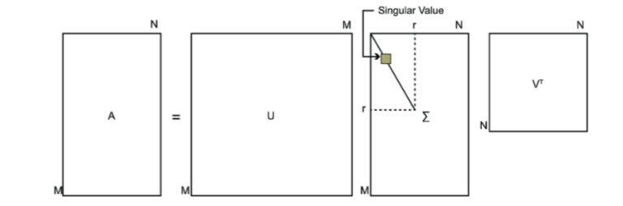

##### 前言
&emsp;&emsp;奇异值分解(Singular Value Decomposition，以下简称SVD)是在一种十分经典的无监督的机器学习算法，它可以用于处理降维算法中的特征分解，还可以用于推荐系统，以及自然语言处理等领域。是很多机器学习算法的基石。
<!--more-->

##### 特征值和特征向量
&emsp;&emsp;再了解SVD之前，对于矩阵的特征值和特征向量还是有必要做一个简单的回顾。  

&emsp;&emsp;假设矩阵$A$是一个实对称矩阵，大小为$n \times n$，如果有一个实数$\lambda$和一个长度为$n$的向量$\alpha$，满足下面的等式关系：
$$
A \alpha = \lambda \alpha \tag{1}
$$
&emsp;&emsp;我们就将$\lambda$称为矩阵$A$的特征值，将$\alpha$称为矩阵$A$的特征向量，是一个列向量。  

&emsp;&emsp;由线性代数的相关知识我们可以知道，对于一个$n$阶的实对称矩阵，一定存在$n$个相互正交的特征向量。对于每一个特征向量，我们可以将其规范化，使其模长$|\alpha|$为1。于是，我们有：
$$
\alpha_i^T \alpha_i = 1 \\
\alpha_i^T \alpha_j = 0, \quad i \ne j
$$
&emsp;&emsp;我们将所有的特征值按照从大到小的顺序进行排列，并将对应的特征的特征向量也按照特征值的大小进行排列，于是，我们会有以下的个排列：
$$
\lambda_1, \lambda_2, \cdots, \lambda_n \\
\alpha_1, \alpha_2, \cdots, \alpha_n
$$
&emsp;&emsp;上面的所有的特征值可以依次被放入一个$ n \times n$的对角矩阵的对角线元素中，我们不妨称这个对角矩阵为$\Sigma​$，于是我们有：
$$
\Sigma = 
\begin{bmatrix}
\lambda_1 & 0 & \cdots & 0 \\
0 & \lambda_2 & \ddots & 0 \\
\vdots & \vdots & \ddots & \vdots \\
0 & 0 & \ddots & \lambda_n \\
\end{bmatrix}
$$
&emsp;&emsp;同样，我们也将上述的特征向量按照特征值的顺序进行排列，也组成了一个$n \times n$的矩阵，不妨记作$W$，于是有：
$$
W = [\alpha_1, \alpha_2, \cdots, \alpha_n]
$$
&emsp;&emsp;综上，我们可以得到如下的关系式：
$$
A W = W \Sigma \tag{2}
$$
&emsp;&emsp;在等式的两边同时乘以$W^{-1}$，我们可以得到：
$$
A = W \Sigma W^{-1} \tag{3}
$$
&emsp;&emsp;考虑到特征向量彼此两两正交，模长为1，我们就有：
$$
W W^T = E \tag{4}
$$
&emsp;&emsp;即：
$$
W^{-1} = W^T \tag{5}
$$
&emsp;&emsp;将式(5)代入式(3)中，我们可以得到：
$$
A = W \Sigma W^{-1} = W \Sigma W^T \tag{6}
$$
&emsp;&emsp;这是一个非常重要的关系，在前面我们就是利用这个关系来计算主成分分析PCA的。

##### 奇异值分解SVD  

&emsp;&emsp;在前面已经找到了一个重要的关系，在我们之前的讨论过程中，我们已经知道满足这个条件的矩阵的要求是该矩阵是一个实对称矩阵，如果只是一个普通的矩阵$A_{m \times n}$，我们其实也可以通过类似的方法进行矩阵分解，这时候我们需要构造的矩阵等式如下：
$$
A = U \Sigma V^T \tag{7}
$$
&emsp;&emsp;其中，$U$是一个大小为$m \times m $的矩阵，$\Sigma$是一个大小为$m \times n$的矩阵，$V^T$是一个大小为$n \times n$的矩阵。



###### 矩阵$U$ 的求解  

&emsp;&emsp;定义了相关的矩阵等式关系之后，我们既需要求解其中的每一个矩阵的具体数值。首先来求解矩阵$U​$的数值。  

&emsp;&emsp;首先构造矩阵$AA^T$，该矩阵是一个大小为$m \times m$的矩阵，然后我们对这个矩阵进行特征值和特征向量的求解，并按照对应特征值的大小对特征向量进行排序。我们这里设特征值序列和特征向量序列如下：
$$
\lambda_1, \lambda_2, \cdots, \lambda_m \\
u_1, u_2, \cdots, u_m
$$
&emsp;&emsp;其中每一对特征值和特征向量都满足：
$$
(AA^T) u_i = \lambda_i u_i \tag{7}
$$


&emsp;&emsp;我们将这些特征向量组合成一个矩阵，就是我们需要的矩阵$U$， 即：
$$
U = \begin{bmatrix} u_1 & u_2 & \cdots & u_m\end{bmatrix}
$$

###### 矩阵$V$ 的求解  

&emsp;&emsp;和求解矩阵$U$类似，首先构造矩阵$A^T A$，该矩阵是一个大小为$n \times n$的矩阵，然后我们对这个矩阵进行特征值和特征向量的求解，并按照对应特征值的大小对特征向量进行排序。我们这里设特征值序列和特征向量序列如下：
$$
\sigma_1, \sigma_2, \cdots, \sigma_n \\
v_1, v_2, \cdots, v_n
$$
&emsp;&emsp;其中每一对特征值和特征向量都满足：
$$
(A^TA) v_i = \sigma_i v_i \tag{8}
$$


&emsp;&emsp;我们将这些特征向量组合成一个矩阵，就是我们需要的矩阵$V​$， 即：
$$
V = \begin{bmatrix} v_1 & v_2 & \cdots & v_n\end{bmatrix}
$$

###### 矩阵$\Sigma$ 的求解  

&emsp;&emsp;当求出矩阵$U​$和矩阵$V​$时，我们就可以求出矩阵$\Sigma​$了：
$$
U \Sigma V^T = A\\
\Sigma = U^{-1} A (V^T)^{-1}
$$
&emsp;&emsp;考虑到矩阵$U$和矩阵$V$的特殊性质，即$U^{-1} = U^T$，$V^{-1} = V^T$，代入上面的式子中，我们有：
$$
\Sigma = U^T A V \tag{9}
$$

###### 原理  

&emsp;&emsp;其实，以上的步骤并不是随便得来的，是有严格证明的，下面以证明矩阵$V​$为例进行说明。

&emsp;&emsp;首先，我们等式$A = U \Sigma V^T$左右两边分别求矩阵转置，得到：
$$
A^T = V \Sigma^T U^T
$$
&emsp;&emsp;接着有：
$$
\begin{aligned}
A^T A &= (V \Sigma^T U^T)(U \Sigma V^T) \\
&= V \Sigma^T U^T U \Sigma V^T \\
&= V \Sigma^T \Sigma V^T \\
&= V (U^T A V)^T (U^T A V) V^T \\
&= V (V^T A^T U)(U^T A V) V^T \\
&= V V^T A^T U U^T A V V^T \\
&= A^T A
\end{aligned}
$$
&emsp;&emsp;注意到上面证明过程的第三行，我们有$A^T A = V \Sigma^T \Sigma V^T $，而矩阵$V$是矩阵$A^T A$的特征向量组成的矩阵，因此，矩阵$\Sigma^T \Sigma$就是矩阵$A^T A$的特征值组成的对角矩阵，这又给了我们一个新的求解$\Sigma$矩阵的方法。 **当我们求出所有的 $A^T A$ 矩阵的特征值之后，我们在这些特征值的基础上进行开方操作，并将结果组成一个对角矩阵，这个对角矩阵就是我们需要的 $\Sigma$ 矩阵。**   所以我们发现，实际上$\Sigma$是一个对角矩阵，只在对角线上存在着有效元素，其他部位的元素都为0。我们将矩阵$\Sigma$的对角线上的元素称为**奇异值**。

&emsp;&emsp;同样的道理，如果我们计算$A A^T$，我们也能得到相同的结果，而计算过程就是证明矩阵$U$的正确性的过程。  

&emsp;&emsp;接下来，我们考虑这样一件事，我们已经求解出了所有的矩阵信息，有$A = U \Sigma V^T$，我们同时在等式的左右两边乘以$V$，有：
$$
AV = U \Sigma V^T V = U \Sigma
$$
&emsp;&emsp;即：
$$
A \begin{bmatrix} v_1 & v_2 & \cdots & v_n\end{bmatrix} = \begin{bmatrix} u_1 & u_2 & \cdots & u_m\end{bmatrix} 
\begin{bmatrix} 
a_1 & \;  & \; \\
\; & a_2 \; & \\
\; & \; & \ddots
\end{bmatrix}_{m \times n}
$$
&emsp;&emsp;其中，$a_i$ 表示的是 $\Sigma$ 矩阵的对角线元素，所以有：
$$
A v_i = u_i a_i
$$
&emsp;&emsp;故：
$$
a_i = \frac{A v_i}{u_i} \tag{9}
$$
&emsp;&emsp;上述也是一种求解$\Sigma$矩阵的方法。

##### SVD的使用  

&emsp;&emsp;接下来，我们通过一个简单的例子来实际使用以下SVD。假设我们的数据矩阵$A$如下：
$$
A = 
\begin{bmatrix} 
1 & 2 \\ 
1 & 0 \\
0 & 1
\end{bmatrix}
$$
&emsp;&emsp;接下来我们计算$A^T A$和$A A^T$，有：
$$
AA^T = \begin{bmatrix} 
1 & 2 \\ 
1 & 0 \\
0 & 1 \\
\end{bmatrix} 
\begin{bmatrix}
1 & 1 & 0 \\
2 & 0 & 1 \\
\end{bmatrix} = 
\begin{bmatrix}
5 & 1 & 2 \\
1 & 1 & 0 \\
2 & 0 & 1 \\
\end{bmatrix} \\
A^TA =  
\begin{bmatrix}
1 & 1 & 0 \\
2 & 0 & 1 \\
\end{bmatrix} \begin{bmatrix} 
1 & 2 \\ 
1 & 0 \\
0 & 1 \\
\end{bmatrix} = \begin{bmatrix} 2 & 2 \\2 & 5 \end{bmatrix}
$$
&emsp;&emsp;对于矩阵$AA^T$，我们可以求解出它的所有的特征值和特征向量，如下：
$$
\quad \lambda_1 = 6, u_1 = 
\begin{bmatrix} 
\frac{5}{\sqrt{30}} \\ 
\frac{1}{\sqrt{30}} \\ 
\frac{2}{\sqrt{30}}
\end{bmatrix} \quad \lambda_2 = 1, u_2 = 
\begin{bmatrix} 0 \\
\frac{2}{\sqrt{5}} \\
-\frac{1}{\sqrt{5}} 
\end{bmatrix} \quad \lambda_3 = 0, u_3 = 
\begin{bmatrix} 
-\frac{1}{\sqrt{6}} \\
\frac{1}{\sqrt{6}} \\
\frac{2}{\sqrt{6}} 
\end{bmatrix}
$$
&emsp;&emsp;对于矩阵$A^TA$，我们可以求解出它的所有的特征值和特征向量，如下：
$$
\lambda_1 = 6, v_1 = \begin{bmatrix} \frac{1}{\sqrt{5}} \\ \frac{2}{\sqrt{5}}\end{bmatrix} \quad \lambda_2 = 1, v_2 = \begin{bmatrix} \frac{2}{\sqrt{5}} \\ -\frac{1}{\sqrt{5}}\end{bmatrix}
$$
&emsp;&emsp;由上面的特征值信息，我们可以求出矩阵$\Sigma$的对角线元素，即直接在特征值的基础上取根号即可，依次为：
$$
a_1 = \sqrt{6}, a_2 = 1
$$
&emsp;&emsp;由上面的所有计算结果，我们可以得到矩阵$U$，$V$和$\Sigma$，如下：
$$
U = \begin{bmatrix} \frac{5}{\sqrt{30}} & 0 & -\frac{1}{\sqrt{6}} \\ \frac{1}{\sqrt{30}} & \frac{2}{\sqrt{5}} &  \frac{1}{\sqrt{6}} \\ \frac{2}{\sqrt{30}} & -\frac{1}{\sqrt{5}} & \frac{2}{\sqrt{6}}\end{bmatrix}
$$
$$
V = \begin{bmatrix} \frac{1}{\sqrt{5}} & \frac{2}{\sqrt{5}} \\ \frac{2}{\sqrt{5}} &  -\frac{1}{\sqrt{5}} \end{bmatrix}
$$
$$
\Sigma = \begin{bmatrix} \sqrt{6} & 0 \\ 0 & 1 \\ 0 & 0 \end{bmatrix}
$$
&emsp;&emsp;于是，我们的原始矩阵$A$可以分解成如下：
$$
A = U \Sigma V^T 
$$
&emsp;&emsp;即：
$$
\begin{bmatrix} 
1 & 2 \\ 
1 & 0 \\
0 & 1
\end{bmatrix} = \begin{bmatrix} \frac{5}{\sqrt{30}} & 0 & -\frac{1}{\sqrt{6}} \\ \frac{1}{\sqrt{30}} & \frac{2}{\sqrt{5}} &  \frac{1}{\sqrt{6}} \\ \frac{2}{\sqrt{30}} & -\frac{1}{\sqrt{5}} & \frac{2}{\sqrt{6}}\end{bmatrix} \begin{bmatrix} \sqrt{6} & 0 \\ 0 & 1 \\ 0 & 0 \end{bmatrix} \begin{bmatrix} \frac{1}{\sqrt{5}} & \frac{2}{\sqrt{5}} \\ \frac{2}{\sqrt{5}} &  -\frac{1}{\sqrt{5}} \end{bmatrix}
$$

&emsp;&emsp;在前面的这个求解的例子中，我们很难发现SVD究竟有什么用处，毕竟求解矩阵乘积，矩阵的特征值和特征向量都是十分复杂是过程。实际上我们在求解奇异值的时候，可以利用矩阵的特征值进行求解，这样奇异值就和特征值具有相同的特点，如果按照从大到小的顺序排列奇异值，我们发现奇异值的数值下降很快，在有些情况下，奇异值前10%~15%的数值之和已经占据了全部奇异值数值之和的90%以上，而过于小的奇异值我们可以将其省略，因为奇异值太小，对最后的生成矩阵影响就会非常小，可以直接忽略不计。当我们采用这种策略的时候，我们可以适当的选取数值最大的几个奇异值，并选取对应的特征向量，这个时候我们就可以只是用这些数据来重构我们的原始矩阵。  


&emsp;&emsp;下面是一个具体的使用SVD重构数据矩阵的python代码实例，数据来源为《机器学习实战》一书。在代码中，我们试图去利用SVD重构一个01矩阵组成的数字0。

&emsp;&emsp;数据如下：

```text
00000000000000110000000000000000
00000000000011111100000000000000
00000000000111111110000000000000
00000000001111111111000000000000
00000000111111111111100000000000
00000001111111111111110000000000
00000000111111111111111000000000
00000000111111100001111100000000
00000001111111000001111100000000
00000011111100000000111100000000
00000011111100000000111110000000
00000011111100000000011110000000
00000011111100000000011110000000
00000001111110000000001111000000
00000011111110000000001111000000
00000011111100000000001111000000
00000001111100000000001111000000
00000011111100000000001111000000
00000001111100000000001111000000
00000001111100000000011111000000
00000000111110000000001111100000
00000000111110000000001111100000
00000000111110000000001111100000
00000000111110000000011111000000
00000000111110000000111111000000
00000000111111000001111110000000
00000000011111111111111110000000
00000000001111111111111110000000
00000000001111111111111110000000
00000000000111111111111000000000
00000000000011111111110000000000
00000000000000111111000000000000
```

&emsp;&emsp;代码如下：

```python
import numpy as np
import math


def load_data():
    matrix = []
    f = open("zero.txt")
    for i in f:
        line = i.strip("\n")
        line = list(line)
        matrix.append([int(i) for i in line])
    return np.array(matrix)


# 调整特征向量，使得所有向量的分量之和为正数。
def adjust(vectors):
    values = np.sum(vectors, axis=0)

    for i, v in enumerate(values):
        if v < 0:
            vectors[:, i] *= -1
    return vectors


# 利用numpy的求解特征值和特征向量的函数进行求解。
def eig(matrix):
    values, vectors = np.linalg.eig(matrix)
    # 有时候函数会返回复数值，这个时候我们只需要取其实数部分。
    values = np.real(values)
    vectors = np.real(vectors)

    # 按照特征值的大小进行排序。
    index = np.argsort(values)[::-1]
    values = values[index]
    vectors = adjust(vectors[:, index])

    # 由于求解过程存在一定的误差，因此特征值会出现极小的负数，我们可以直接将其置为0。
    values = np.maximum(values, 0)
    return values, vectors


def svd(matrix):
    # 返回左侧矩阵的特征值和特征向量
    left_values, left_vectors = eig(np.matmul(matrix, np.transpose(matrix)))

    # 返回右侧矩阵的特征值和特征向量
    right_values, right_vectors = eig(np.matmul(np.transpose(matrix), matrix))

    # Sigma矩阵
    sigma = np.zeros_like(matrix, dtype=np.float64)

    for i in range(min(len(left_values), len(right_values))):
        sigma[i][i] = math.sqrt(left_values[i])

    printMat(np.matmul(np.matmul(left_vectors, sigma), np.transpose(right_vectors)))
    pass


# 输出，这里借鉴了《机器学习实战》一书的输出模板
def printMat(inMat, thresh=0.6):
    for i in range(32):
        for k in range(32):
            if float(inMat[i, k]) > thresh:
                print("1", end="")
            else:
                print("0", end="")
        print()


if __name__ == '__main__':
    matrix = load_data()
    svd(matrix)

```

&emsp;&emsp;结果如下：

```text
00000000000000000010000000000000
00000000000011011110000000000000
00000000000111111110000000000000
00000000001111111111000000000000
00000000000111111110111010000000
00000000001101111111111110000000
00000000011111111111111010000000
00000000001111000001111110000000
00000000001111000001111110000000
00000011111100000000111100000000
00000011111100000000111100000000
00000011111100000000011110000000
00000011111100000000011110000000
00000000111110000000001111000000
00000011111110000000001111000000
00000011111100000000001111000000
00000001111100000000001111000000
00000011111100000000001111000000
00000001111100000000001111000000
00000001111100000000001110000000
00000000111110000000001111100000
00000000111110000000001111100000
00000000111110000000001111100000
00000000111110000000001111000000
00000000111110000000111101000000
00000000111111000001111110000000
00000000111111111111111100000000
00000000111111111111100000000000
00000000111111111111100000000000
00000000000011111111100000000000
00000000000011111111110000000000
00000000000000111111000000000000
```

&emsp;&emsp;可以看到，我们自己实现的SVD可以较好地重构出原始数据矩阵。由于求解过程中的误差，我们的重构结果和实际的数据矩阵还是有些不同的，所以，numpy已经将SVD进行了封装，我们可以直接使用其封装好的函数进行求解SVD，这样求出的结果会比自己手动求解的结果好。

&emsp;&emsp;使用numpy中的SVD的代码如下：

```python
import numpy as np
import math


def load_data():
    matrix = []
    f = open("zero.txt")
    for i in f:
        line = i.strip("\n")
        line = list(line)
        matrix.append([int(i) for i in line])
    return np.array(matrix)


def printMat(inMat, thresh=0.8):
    for i in range(32):
        for k in range(32):
            if float(inMat[i, k]) > thresh:
                print(1, end="")
            else:
                print(0, end="")
        print()


def imgCompress(numSV=5, thresh=0.8):
    matrix = load_data()

    print("****original matrix******")
    printMat(matrix, thresh)
    U, Sigma, VT = np.linalg.svd(matrix)
    SigRecon = np.zeros((numSV, numSV))
    for k in range(numSV):  # construct diagonal matrix from vector
        SigRecon[k, k] = Sigma[k]
    reconMat = np.matmul(np.matmul(U[:, :numSV], SigRecon), VT[:numSV, :])
    print("****reconstructed matrix using %d singular values******" % numSV)
    printMat(reconMat, thresh)


if __name__ == '__main__':
    imgCompress()

```

&emsp;&emsp;结果如下：

```text
****original matrix******
00000000000000110000000000000000
00000000000011111100000000000000
00000000000111111110000000000000
00000000001111111111000000000000
00000000111111111111100000000000
00000001111111111111110000000000
00000000111111111111111000000000
00000000111111100001111100000000
00000001111111000001111100000000
00000011111100000000111100000000
00000011111100000000111110000000
00000011111100000000011110000000
00000011111100000000011110000000
00000001111110000000001111000000
00000011111110000000001111000000
00000011111100000000001111000000
00000001111100000000001111000000
00000011111100000000001111000000
00000001111100000000001111000000
00000001111100000000011111000000
00000000111110000000001111100000
00000000111110000000001111100000
00000000111110000000001111100000
00000000111110000000011111000000
00000000111110000000111111000000
00000000111111000001111110000000
00000000011111111111111110000000
00000000001111111111111110000000
00000000001111111111111110000000
00000000000111111111111000000000
00000000000011111111110000000000
00000000000000111111000000000000
****reconstructed matrix using 5 singular values******
00000000000000000000000000000000
00000000000000111100000000000000
00000000000000111110000000000000
00000000000011111110000000000000
00000000111111111111000000000000
00000000111111111111100000000000
00000000111111111111110000000000
00000000111111000001111000000000
00000000111110000000111000000000
00000001111100000000011100000000
00000011111100000000011110000000
00000011111100000000011110000000
00000011111100000000011110000000
00000000111100000000001111000000
00000001111100000000001111000000
00000001111100000000001111000000
00000001111100000000001111000000
00000001111100000000001111000000
00000001111100000000001111000000
00000001111100000000001110000000
00000000111110000000001111000000
00000000111110000000001111000000
00000000111110000000001111000000
00000000111110000000001111000000
00000000111110000000001110000000
00000000111110000000111100000000
00000000001111111111111110000000
00000000000111111111111110000000
00000000000111111111111110000000
00000000000011111111110000000000
00000000000011111111100000000000
00000000000000111110000000000000
```


&emsp;&emsp;可以发现，当我们只使用5个奇异值以及其对应的特征向量的时候，我们就可以获得非常好的重构效果，这个时候，我们的数据量为：
$$
s = 32 * 5 + 5 + 5 * 32 = 325 \\
compress\_rate = \frac{325}{32 * 32} = 37.1\%
$$
&emsp;&emsp;我们的数据量仅仅是原来的三分之一，因此可以SVD很好的进行数据压缩。

##### SVD和PCA  

&emsp;&emsp;在求解SVD的过程中，我们求解了两个特殊的矩阵$U$ 和$V$ ，实际上，$U$ 被称为是左奇异矩阵，$V$ 被称为是右奇异矩阵。

&emsp;&emsp;回想起在求解PCA的过程中，我们也需要求解右奇异矩阵，并利用右奇异矩阵进行了数据的降维，这就是右奇异矩阵的作用之一。当我们考察左奇异矩阵的时候，发现合理的使用右奇异矩阵本质上是对数据量进行了一定的减小，当我们拥有一个矩阵$A$，大小为$m \times n$，其中，$m$ 表示的是数据量，即行数，$n$ 表示的是数据的维度数目，即列数，当我们对数据矩阵右乘右奇异矩阵的时候，列数可以根据选择的特征向量的数目进行减小，当我们当数据矩阵左乘左奇异矩阵的时候，行数可以根据选择的特征向量的数目进行减小。因此，左奇异矩阵可以压缩行数，右奇异矩阵可以压缩列数，综合在一起就可以对数据进行较为全面的压缩。

