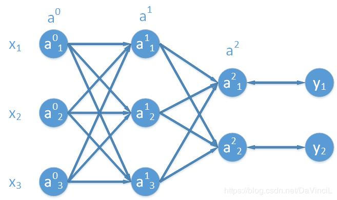
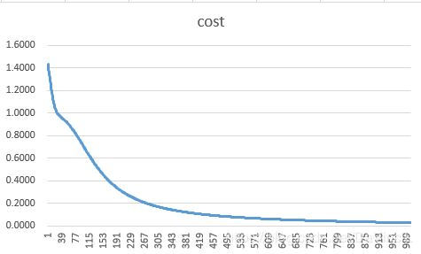

##### 前言  
&emsp;&emsp;前面介绍了单层全连接层并使用激活函数激活的情况，尝试去进行了多样本的梯度下降计算，这一篇文章打算简单介绍一下多层全连接层的梯度下降的情况，重点在于如何进行梯度的向后传播。还是请注意：这里的所有推导过程都只是针对当前设置的参数信息，并不具有一般性，但是所有的推导过程可以推导到一般的运算，因此以下给出的并不是反向传播算法的严格证明，但是可以很好的帮助理解反向传播算法。  

<!--more-->


##### 一、模型定义  

&emsp;&emsp;和前面的模型类似，我们使用的输入是一个长度为3的行向量，输出为长度为2的行向量，激活函数设置为 $g$，我们这里使用的是sigmoid激活函数，即：
$$
g(x) = \frac{1}{1 + e^{-x}} \tag{1}
$$
&emsp;&emsp;模型定义如图，首先定义一下字母记号（这里的字母表示是根据我自己的习惯来的，和其他的表示方法或许有点不同，不过没有关系。），$L$表示网络的层数，在我们上图中，可以靠打拼一共有三层(包括输入层)，所以$L = 3$。我们记网络的第$i$层为$a^i$，将输入层记作$a^0 = x$，很明显，输出层我们可以记作$a^{L-1} = \hat{y}$，这里的 $\hat{y}$ 表示整个网络的输出。一般地，我们使用上标标记参数是属于网络的哪一层，下标表示该参数在参数矩阵（向量）中的位置。

&emsp;&emsp;我们在这里使用$z^i$表示还没有使用激活函数的网络第$i$层，很明显这里的$i$的范围是：$1 \leq i \leq L-1$，因为输入层不需要使用激活函数激活。

&emsp;&emsp;于是,我们可以得到下面的式子：
$$
\begin{aligned}
z^0 &= a^0 \omega^0 + b^0 \\
a^1 &= g(z^0)  \\
z^1 &= a^1 \omega^1 + b^1 \\
\hat{y} &= a^2 = g(z^1)
\end{aligned}
$$
&emsp;&emsp;其中的 $\omega$表示的是每一层全连接的权重矩阵，$b$表示的是每一层的偏置量。不难看出，$\omega^0$是一个3x3大小的矩阵，$b^0$是一个长度为3的行向量，$\omega^1$是一个3x2大小的矩阵，$b^1$是一个长度为2的行向量。
&emsp;&emsp;和前面定义的模型类似，这里我们仍然使用差的平方之和作为最后的损失函数，即：
$$
C = cost(\hat{y}, y) = \sum(\hat{y}_i - y_i)^2 = (\hat{y}_1 - y_1)^2 + (\hat{y}_2 - y_2)^2 = (a^2_1 - y_1)^2 + (a^2_2 - y_2)^2 \tag{2}
$$

##### 二、基本原理  
&emsp;&emsp;首先要了解的是，所谓的反向传播，到底向后传播的是什么。简单来说，算法向后传播的是误差，即我们希望的目标值和真实值之间的差距，这里的目标值是网络每一层的输出，这里的真实值是理想中的那个完美的模型产生的数值。但是很显然，我们并不了解那个完美模型的每一层的输出是什么，我们只知道最后的标签（即 $y$ ），所以我们需要根据最后一层的输出和 $y$ 之间的误差，去调整每一层的输出，在这个调整的过程中，我们就是在调整每一层的权值和偏置量。

###### 理解偏导数
&emsp;&emsp;对于偏导数 $\frac{\partial C}{\partial a^{i}} ,(1 \leq i \leq L - 1)$，我们可以将这个偏导数理解成对于 $a^i$的一个小小的变化，$C$能有多敏感，我们这里说到的敏感度和前面说的误差本质上是一回事，因为每一层的 $a$都受到前面一层的输出的影响，所以当我们在向后传播误差到前面的全连接层的时候，我们必然会求出每一层的偏导数，即 $\frac{\partial C}{\partial a^{i}} ,(1 \leq i \leq L - 1)$。此处 $i$不会取到0，这是因为在我们设定的模型结构中，$a^0$ 表示的是输出层，而输入层本质上是不包含误差的，因此在我们这样的设置下，$i$的范围是$1，2，...,L- 1$。需要注意的是，有些网络会将输入层表示为 $a^1$，此时，$i$的最小取值就是2。不管如何设置，这些都是基于相同的原理。

###### 求解偏导数
&emsp;&emsp;假设我们现在只关注最后的一层全连接层，会有：
$$
g(\begin{bmatrix} a^1_1 & a^1_2 & a^1_3 \end{bmatrix} \begin{bmatrix} \omega^1_{11} & \omega^1_{12} \\ \omega^1_{21} & \omega^1_{22} \\ \omega^1_{31} & \omega^1_{32} \\ \end{bmatrix} + \begin{bmatrix} b^1_1 & b^1_2\end{bmatrix}) = \begin{bmatrix} a^2_1 & a^2_2 \end{bmatrix} \tag{3}
$$
&emsp;&emsp;我们沿用之前定义好的字母表示方法，用 $z^i$表示每一层未被激活时的矩阵，于是，我们可以有下面的式子：
$$
z^1 = a^1 \omega^1 + b^1 \\
a^2 = g(z^1) \\
C = \sum (a^2_i - y_i) ^2
$$
&emsp;&emsp;将上面的第一个式子展开，我们有：
$$
\begin{bmatrix} z^1_1 & z^1_2\end{bmatrix} = \begin{bmatrix} a^1_1 & a^1_2 & a^1_3 \end{bmatrix} \begin{bmatrix} \omega^1_{11} & \omega^1_{12} \\ \omega^1_{21} & \omega^1_{22} \\ \omega^1_{31} & \omega^1_{32} \\ \end{bmatrix} + \begin{bmatrix} b^1_1 & b^1_2\end{bmatrix} \tag{4}
$$
&emsp;&emsp;继续将式子完全展开：
$$
z^1_1 = a^1_1 \omega^1_{11} + a^1_2 \omega^1_{21} + a^1_3 \omega^1_{31} + b^1_1 \tag{5}
$$
$$
z^1_2 = a^1_1 \omega^1_{12} + a^1_2 \omega^1_{22} + a^1_3 \omega^1_{32} + b^1_2 \tag{6}
$$
&emsp;&emsp;接着我们对前一层的输出求解偏导数，即，我们需要对 $a^1_1$，$a^1_2$，$a^1_3$求解偏导数。所以我们会有：
$$
\frac{\partial z^1_1}{\partial a^1_1} = \omega^1_{11},\frac{\partial z^1_1}{\partial a^1_2} = \omega^1_{21},\frac{\partial z^1_1}{\partial a^1_3} = \omega^1_{31} \tag{7}
$$
$$
\frac{\partial z^1_2}{\partial a^1_1} = \omega^1_{12},\frac{\partial z^1_2}{\partial a^1_2} = \omega^1_{22},\frac{\partial z^1_2}{\partial a^1_3} = \omega^1_{32} \tag{8}
$$
&emsp;&emsp;确实，这一步有些难以理解，实际上我们只是将后面一层的误差（敏感程度）通过求导的方式传递到前面一层而已。

###### 对 $z^i$求偏导数
&emsp;&emsp;我们考虑对 $z^1 = \begin{bmatrix} z^1_1 & z^1_2 \end{bmatrix}$ 使用非线性激活函数激活，即我们有：
$$
a^2 = g(z^1) \tag{9}
$$
&emsp;&emsp;展开之后就变成：
$$
\begin{bmatrix} a^2_1 & a^2_2 \end{bmatrix} = g(\begin{bmatrix} z^1_1 & z^1_2 \end{bmatrix}) \tag{10}
$$
&emsp;&emsp;对应每一个元素，我们有：
$$
a^2_1 = g(z^1_1), a^2_2 = g(z^1_2) \tag{11}
$$
&emsp;&emsp;所以我们求得每一个 $\hat{y}_i$ 对 $a_i$ 的偏导数如下：
$$
\frac{\partial a^2_1}{\partial z^1_1} = g\prime(z^1_1), \frac{\partial a^2_2}{\partial z^1_2} = g\prime(z^1_2) \tag{12}
$$

###### cost值的相关偏导数
&emsp;&emsp;因为 $C = cost = (a^2_1 - y_1)^2 + (a^2_2 - y_2)^2$，所以我们可以求得：
$$
\frac{\partial C}{\partial a^2_1} = 2 (a^2_1 - y_1),\frac{\partial C}{\partial a^2_2} = 2 (a^2_2 - y_2) \tag{13}
$$

###### 整理总结
&emsp;&emsp;根据我们之前求出来的结果，我们可以将误差传递至 $a^1$层，于是，我们可以得到下面的几个式子：
$$
\frac{\partial C}{\partial a^1_1} = \frac{\partial z^1_1}{\partial a^1_1} \cdot \frac{\partial a^2_1}{\partial z^1_1} \cdot \frac{\partial C}{\partial a^2_1} \tag{14.1}
$$
$$
\frac{\partial C}{\partial a^1_2} = \frac{\partial z^1_1}{\partial a^1_2} \cdot \frac{\partial a^2_1}{\partial z^1_1} \cdot \frac{\partial C}{\partial a^2_1} \tag{14.2}
$$
$$
\frac{\partial C}{\partial a^1_3} = \frac{\partial z^1_1}{\partial a^1_3} \cdot \frac{\partial a^2_1}{\partial z^1_1} \cdot \frac{\partial C}{\partial a^2_1} \tag{14.3}
$$
$$
\frac{\partial C}{\partial a^1_1} = \frac{\partial z^1_2}{\partial a^1_1} \cdot \frac{\partial a^2_2}{\partial z^1_2} \cdot \frac{\partial C}{\partial a^2_2} \tag{14.4}
$$
$$
\frac{\partial C}{\partial a^1_2} = \frac{\partial z^1_2}{\partial a^1_2} \cdot \frac{\partial a^2_2}{\partial z^1_2} \cdot \frac{\partial C}{\partial a^2_2} \tag{14.5}
$$
$$
\frac{\partial C}{\partial a^1_3} = \frac{\partial z^1_2}{\partial a^1_3} \cdot \frac{\partial a^2_2}{\partial z^1_2} \cdot \frac{\partial C}{\partial a^2_2} \tag{14.6}
$$
&emsp;&emsp;我们发现，上面的公式中，(14.1)和(14.4)，(14.2)和(14.5)，(14.3)和(14.6)计算的时同一个偏导数，那么究竟哪个偏导数的计算时正确的呢？实际上，每一个都不是正确的，但是每一个有都不是错误的，或者说每一个都只做了一半。这是因为每一个值都可以通过多条路径去影响最后的cost值。例如，以 $a^1_1$为例，它既可以和 $\omega^1_{11}$ 相乘来影响 $a^2_1$ ，也可以通过和 $\omega^1_{12}$ 相乘来影响 $a^2_2$ ，而这两条路最后都会影响cost值，因此，我们需要将所有的偏导数公式进行相加，得到我们最后真正的偏导数计算公式。

&emsp;&emsp;注意：实际上，如果对高等数学的链式法则求导有更深入的观察，可以一步就写出最后的偏导数公式，而我们上面这样做其实是不正确的，但是可以得出正确的结果。

$$
\frac{\partial C}{\partial a^1_1} = \frac{\partial z^1_1}{\partial a^1_1} \cdot \frac{\partial a^2_1}{\partial z^1_1} \cdot \frac{\partial C}{\partial a^2_1} + \frac{\partial z^1_2}{\partial a^1_1} \cdot \frac{\partial a^2_2}{\partial z^1_2} \cdot \frac{\partial C}{\partial a^2_2} \tag{15.1}
$$
$$
\frac{\partial C}{\partial a^1_2} = \frac{\partial z^1_1}{\partial a^1_2} \cdot \frac{\partial a^2_1}{\partial z^1_1} \cdot \frac{\partial C}{\partial a^2_1} + \frac{\partial z^1_2}{\partial a^1_2} \cdot \frac{\partial a^2_2}{\partial z^1_2} \cdot \frac{\partial C}{\partial a^2_2} \tag{15.2}
$$
$$
\frac{\partial C}{\partial a^1_3} = \frac{\partial z^1_1}{\partial a^1_3} \cdot \frac{\partial a^2_1}{\partial z^1_1} \cdot \frac{\partial C}{\partial a^2_1} +\frac{\partial z^1_2}{\partial a^1_3} \cdot \frac{\partial a^2_2}{\partial z^1_2} \cdot \frac{\partial C}{\partial a^2_2} \tag{15.3}
$$
&emsp;&emsp;同样，和前面一样，我们需要对上面的公式进行向量化的表示，这样代码编写会方便很多且不易出错。我们将(15.1)，(15.2)和(15.3)的结果整理成一个行向量（因为我们设定的模型的输入是一个行向量，所以，模型每一层的输出也都是一个行向量。行向量如下：
$$
\begin{aligned}
\begin{bmatrix} \frac{\partial C}{\partial a^1_1} & \frac{\partial C}{\partial a^1_2} & \frac{\partial C}{\partial a^1_3}\end{bmatrix} &= \begin{bmatrix} \frac{\partial a^2_1}{\partial z^1_1} \cdot \frac{\partial C}{\partial a^2_1} & \frac{\partial a^2_2}{\partial z^1_2} \cdot \frac{\partial C}{\partial a^2_2} \end{bmatrix} \begin{bmatrix} \frac{\partial z^1_1}{\partial a^1_1} & \frac{\partial z^1_1}{\partial a^1_2} & \frac{\partial z^1_1}{\partial a^1_3} \\ \frac{\partial z^1_2}{\partial a^1_1} & \frac{\partial z^1_2}{\partial a^1_2} & \frac{\partial z^1_2}{\partial a^1_3} \end{bmatrix} \\ &= (\begin{bmatrix} \frac{\partial a^2_1}{\partial z^1_1} & \frac{\partial a^2_2}{\partial z^1_2}\end{bmatrix} \cdot * \begin{bmatrix} \frac{\partial C}{\partial a^2_1} & \frac{\partial C}{\partial a^2_2} \end{bmatrix}) \begin{bmatrix} \frac{\partial z^1_1}{\partial a^1_1} & \frac{\partial z^1_1}{\partial a^1_2} & \frac{\partial z^1_1}{\partial a^1_3} \\ \frac{\partial z^1_2}{\partial a^1_1} & \frac{\partial z^1_2}{\partial a^1_2} & \frac{\partial z^1_2}{\partial a^1_3} \end{bmatrix} \\ &= (g\prime(z^1) \cdot * \begin{bmatrix} \frac{\partial C}{\partial a^2_1} & \frac{\partial C}{\partial a^2_2} \end{bmatrix}) \begin{bmatrix} \omega^1_{11} & \omega^1_{21} & \omega^1_{31} \\ \omega^1_{12} & \omega^1_{22} & \omega^1_{32} \end{bmatrix} \\ &= (g\prime(z^1) \cdot * \begin{bmatrix} \frac{\partial C}{\partial a^2_1} & \frac{\partial C}{\partial a^2_2} \end{bmatrix}) (\omega^1)^T 
\end{aligned} \tag{16}
$$
&emsp;&emsp;在上面的公式中，$(\omega^1)^T​$ 表示的是 $\omega^1​$ 参数矩阵的转置，$\cdot *​$ 符号表示的是矩阵（向量）之间的点乘，即对应元素之间的相乘。
&emsp;&emsp;如果我们将 $\begin{bmatrix} \frac{\partial C}{\partial a^2_1} & \frac{\partial C}{\partial a^2_2} \end{bmatrix}​$ 记作 $\delta^2​$ ，将 $\begin{bmatrix} \frac{\partial C}{\partial a^1_1} & \frac{\partial C}{\partial a^1_2} & \frac{\partial C}{\partial a^1_3}\end{bmatrix}​$ 记作 $\delta^1​$，那么我们就会得到更加简化的公式：
$$
\delta^1 = (g\prime(z^1) \cdot * \delta^2)(\omega^1)^T \tag{17}
$$
&emsp;&emsp;公式(17)就是我们需要找到的反向传播的核心公式。更一般的，如果我们有 $L$ 层网络（包括输入层，那么，误差向后传递的核心公式就是如下：
$$
\delta^i = (g\prime(z^i) \cdot * \delta^{i + 1})(\omega^i)^T \quad (1 \leq i \leq L - 1) \tag{18}
$$
&emsp;&emsp;其中，最后一层的 $\delta^{L-1}$ 就是根据输出值和真实值的计算公式，对每一个输出值进行求导操作。


###### 根据传递来的误差进行参数的更新
&emsp;&emsp;现在，让我们重新审视一下我们之前在第二篇中求解出的参数更新公式。
$$
\frac{\partial C}{\partial \omega} = x^T (\begin{bmatrix} g\prime(a_1) & g\prime(a_2) \end{bmatrix} \cdot * \begin{bmatrix} 2 \cdot (\hat{y}_1 - y_1) & 2 \cdot (\hat{y}_2 - y_2)\end{bmatrix}) \tag{19}
$$
$$
\frac{\partial C}{\partial b} = \begin{bmatrix} g\prime(a_1) & g\prime(a_2) \end{bmatrix} \cdot * \begin{bmatrix} 2 \cdot (\hat{y}_1 - y_1) & 2 \cdot (\hat{y}_2 - y_2)\end{bmatrix} \tag{20}
$$
&emsp;&emsp;按照我们在这一篇中使用的符号记法，重新写一下会有（因为这里有两层全连接层，之前只有一层，因此，我们这里的 $\omega$ 和 $b$ 都使用的是最后一层的权值和偏置量，因此 $x$ 就变成了倒数第二层的输出 $a^1$。）：
$$
\frac{\partial C}{\partial \omega^1} = (a^1)^T(g\prime(z^1) \cdot * \delta^2) \tag{21}
$$
$$
\frac{\partial C}{\partial b^1} = g\prime(z^1) \cdot * \delta^2 \tag{22}
$$
&emsp;&emsp;于是根据上面的式子，我们就可以归纳出一般情况下的权重和偏置量的偏导数公式了。如果按照我们这篇文章中的字母记号的方法，那么，我们可以有：（$0 \leq i \leq L- 2$，$L$表示的是网络的层数，包括输入层。）
$$
\frac{\partial C}{\partial \omega^i} = (a^i)^T(g\prime(z^i) \cdot * \delta^{i+1}) \tag{23}
$$
$$
\frac{\partial C}{\partial b^i} = g\prime(z^i) \cdot * \delta^{i+1} \tag{24}
$$

&emsp;&emsp;**公式(18),(23),(24)就是反向传播算法的核心公式了，一般而言，我们首先会求出所有的 $\delta$ 参数，再根据 $\delta$参数去求解所有的参数梯度，最后统一进行梯度的更新。**  

##### 三、代码  
&emsp;&emsp;和文中所使用的模型是一样的，由两个全连接层构成，使用sigmoid函数激活。
```python
import numpy as np

param = {}
nodes = {}

learning_rate = 0.1


def sigmoid(x):
    return 1.0 / (1. + np.exp(- x))


def sigmoid_gradient(x):
    sig = sigmoid(x)
    return sig * (1. - sig)


def cost(y_pred, y):
    return np.sum((y_pred - y) ** 2)


def cost_gradient(y_pred, y):
    return 2 * (y_pred - y)


def forward(x):
    nodes["a0"] = x
    nodes['matmul0'] = np.matmul(x, param['w0'])
    nodes['z0'] = nodes['matmul0'] + param['b0']
    nodes["a1"] = sigmoid(nodes['z0'])

    nodes['matmul1'] = np.matmul(nodes['a1'], param['w1'])
    nodes['z1'] = nodes['matmul1'] + param['b1']
    nodes['a2'] = sigmoid(nodes['z1'])
    return nodes['a2']
    pass


def backward(x, y_pred, y):
    """compute delta"""
    delta2 = cost_gradient(y_pred, y)
    delta1 = np.matmul(np.multiply(sigmoid_gradient(nodes['z1']), delta2), np.transpose(param['w1']))

    """update"""
    gradient = {}
    gradient['w1'] = np.matmul(np.transpose(nodes['a1']),
                               np.multiply(sigmoid_gradient(nodes["z1"]), delta2))
    gradient['b1'] = np.mean(np.multiply(sigmoid_gradient(nodes["z1"]), delta2), axis=0)

    gradient["w0"] = np.matmul(np.transpose(nodes['a0']),
                               np.multiply(sigmoid_gradient(nodes["z0"]), delta1))
    gradient['b0'] = np.mean(np.multiply(sigmoid_gradient(nodes["z0"]), delta1), axis=0)

    param['w1'] -= learning_rate * gradient['w1']
    param['b1'] -= learning_rate * gradient['b1']
    param["w0"] -= learning_rate * gradient['w0']
    param['b0'] -= learning_rate * gradient['b0']
    pass


def setup():
    x = np.array([[1., 2., 3.],
                  [3., 2., 1.]])
    y = np.array([[1., 0.],
                  [0., 1.]])

    param['w0'] = np.random.random([3, 3])
    param['b0'] = np.array([0., 0., 0.])

    param['w1'] = np.random.random([3, 2])
    param['b1'] = np.array([0., 0.])

    for i in range(1000):
        y_pred = forward(x)
        backward(x, y_pred, y)
        print("梯度下降前：", y_pred, "\n梯度下降后：", forward(x), "\ncost：", cost(forward(x), y))


if __name__ == '__main__':
    setup()

```
&emsp;&emsp;结果如下：
```text
梯度下降前： [[0.79830536 0.83580604]
 [0.80449064 0.83875726]]
梯度下降后： [[0.78872254 0.82729775]
 [0.79552187 0.83086468]]
cost： 1.3905215341662558
梯度下降前： [[0.78872254 0.82729775]
 [0.79552187 0.83086468]]
梯度下降后： [[0.77882103 0.81832367]
 [0.78626614 0.82257321]]
cost： 1.3682684724974281
梯度下降前： [[0.77882103 0.81832367]
 [0.78626614 0.82257321]]
梯度下降后： [[0.76863531 0.80888786]
 [0.77675443 0.81388922]]
cost： 1.3458138579376486
梯度下降前： [[0.76863531 0.80888786]
 [0.77675443 0.81388922]]
梯度下降后： [[0.75820643 0.79900214]
 [0.76702339 0.8048258 ]]
cost： 1.3232863979727467
梯度下降前： [[0.75820643 0.79900214]
 [0.76702339 0.8048258 ]]
梯度下降后： [[0.74758142 0.78868705]
 [0.75711474 0.79540344]]
cost： 1.3008248813647023
梯度下降前： [[0.74758142 0.78868705]
 [0.75711474 0.79540344]]
梯度下降后： [[0.73681235 0.77797253]
 [0.74707448 0.7856506 ]]
cost： 1.27857494201472
梯度下降前： [[0.73681235 0.77797253]
 [0.74707448 0.7856506 ]]
梯度下降后： [[0.72595508 0.76689824]
 [0.73695182 0.77560392]]
cost： 1.2566851295390669
梯度下降前： [[0.72595508 0.76689824]
 [0.73695182 0.77560392]]
梯度下降后： [[0.71506782 0.75551347]
 [0.72679789 0.76530802]]
cost： 1.2353024551577543
梯度下降前： [[0.71506782 0.75551347]
 [0.72679789 0.76530802]]
梯度下降后： [[0.70420955 0.74387642]
 [0.71666439 0.75481498]]
cost： 1.214567655578547
梯度下降前： [[0.70420955 0.74387642]
 [0.71666439 0.75481498]]
梯度下降后： [[0.69343832 0.73205294]
 [0.70660222 0.74418325]]
cost： 1.1946104774003092
梯度下降前： [[0.69343832 0.73205294]
 [0.70660222 0.74418325]]
梯度下降后： [[0.68280973 0.72011482]
 [0.69666013 0.73347616]]
cost： 1.1755453177778676
梯度下降前： [[0.68280973 0.72011482]
 [0.69666013 0.73347616]]
梯度下降后： [[0.67237554 0.70813752]
 [0.68688359 0.72276011]]
cost： 1.1574675529546317
梯度下降前： [[0.67237554 0.70813752]
 [0.68688359 0.72276011]]
梯度下降后： [[0.66218247 0.69619771]
 [0.67731377 0.71210253]]
cost： 1.1404508391169166
梯度下降前： [[0.66218247 0.69619771]
 [0.67731377 0.71210253]]
梯度下降后： [[0.65227136 0.6843707 ]
 [0.66798687 0.70156968]]
cost： 1.124545582249731
梯度下降前： [[0.65227136 0.6843707 ]
 [0.66798687 0.70156968]]
梯度下降后： [[0.64267666 0.67272797]
 [0.65893364 0.69122464]]
cost： 1.1097786568052626
梯度下降前： [[0.64267666 0.67272797]
 [0.65893364 0.69122464]]
梯度下降后： [[0.63342615 0.66133502]
 [0.6501792  0.68112551]]
cost： 1.0961543258622262
梯度下降前： [[0.63342615 0.66133502]
 [0.6501792  0.68112551]]
梯度下降后： [[0.62454101 0.65024966]
 [0.64174305 0.6713239 ]]
cost： 1.0836561996688798
梯度下降前： [[0.62454101 0.65024966]
 [0.64174305 0.6713239 ]]
梯度下降后： [[0.61603613 0.63952088]
 [0.63363933 0.66186397]]
cost： 1.0722499837437804
梯度下降前： [[0.61603613 0.63952088]
 [0.63363933 0.66186397]]
梯度下降后： [[0.60792055 0.62918816]
 [0.62587715 0.6527818 ]]
cost： 1.0618867231940436
梯度下降前： [[0.60792055 0.62918816]
 [0.62587715 0.6527818 ]]
梯度下降后： [[0.60019807 0.61928143]
 [0.61846111 0.64410532]]
cost： 1.0525062481304481
梯度下降前： [[0.60019807 0.61928143]
 [0.61846111 0.64410532]]
梯度下降后： [[0.59286793 0.60982139]
 [0.6113918  0.63585445]]
cost： 1.0440405589832986
梯度下降前： [[0.59286793 0.60982139]
 [0.6113918  0.63585445]]
梯度下降后： [[0.5859255  0.60082016]
 [0.60466638 0.62804172]]
cost： 1.036416947829888
梯度下降前： [[0.5859255  0.60082016]
 [0.60466638 0.62804172]]
梯度下降后： [[0.57936295 0.59228224]
 [0.59827914 0.62067296]]
cost： 1.029560718871301
梯度下降前： [[0.57936295 0.59228224]
 [0.59827914 0.62067296]]
梯度下降后： [[0.57316992 0.58420554]
 [0.59222202 0.61374817]]
cost： 1.0233974361978069
梯度下降前： [[0.57316992 0.58420554]
 [0.59222202 0.61374817]]
梯度下降后： [[0.5673341  0.57658245]
 [0.58648511 0.60726243]]
cost： 1.0178546819469387
梯度下降前： [[0.5673341  0.57658245]
 [0.58648511 0.60726243]]
梯度下降后： [[0.56184178 0.56940091]
 [0.58105707 0.6012068 ]]
cost： 1.0128633489602261
......
梯度下降前： [[0.94927668 0.05029516]
 [0.05573697 0.94479925]]
梯度下降后： [[0.94931374 0.05025926]
 [0.05570013 0.94483464]]
cost： 0.011240812046284514
梯度下降前： [[0.94931374 0.05025926]
 [0.05570013 0.94483464]]
梯度下降后： [[0.94935073 0.05022344]
 [0.05566335 0.94486995]]
cost： 0.011225473896214073
梯度下降前： [[0.94935073 0.05022344]
 [0.05566335 0.94486995]]
梯度下降后： [[0.94938765 0.05018769]
 [0.05562665 0.9449052 ]]
cost： 0.011210176001756078
梯度下降前： [[0.94938765 0.05018769]
 [0.05562665 0.9449052 ]]
梯度下降后： [[0.94942449 0.05015202]
 [0.05559002 0.94494039]]
cost： 0.011194918207872375
梯度下降前： [[0.94942449 0.05015202]
 [0.05559002 0.94494039]]
梯度下降后： [[0.94946125 0.05011641]
 [0.05555345 0.94497551]]
cost： 0.011179700360308792
梯度下降前： [[0.94946125 0.05011641]
 [0.05555345 0.94497551]]
梯度下降后： [[0.94949794 0.05008087]
 [0.05551696 0.94501057]]
cost： 0.011164522305590443
梯度下降前： [[0.94949794 0.05008087]
 [0.05551696 0.94501057]]
梯度下降后： [[0.94953456 0.05004541]
 [0.05548053 0.94504556]]
cost： 0.011149383891016414
梯度下降前： [[0.94953456 0.05004541]
 [0.05548053 0.94504556]]
梯度下降后： [[0.9495711  0.05001001]
 [0.05544418 0.94508049]]
cost： 0.011134284964655492
梯度下降前： [[0.9495711  0.05001001]
 [0.05544418 0.94508049]]
梯度下降后： [[0.94960757 0.04997468]
 [0.05540789 0.94511535]]
cost： 0.011119225375340889
```
&emsp;&emsp;可以看到，我们的算法是可以很好的进行反向传播，并且可以很好地减小cost值。  
