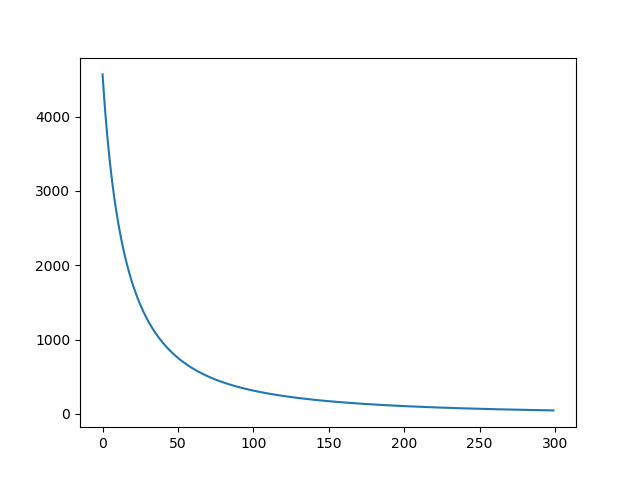

##### 前言  

&emsp;&emsp;前面讲了很多二维平面上的卷积，甚至用代码实现了一个简单的两层二维卷积网络，但是在实际的情况下，我们使用的更多的是三维矩阵，即矩阵的$shape$往往是$[height, width, channels]$。在这种情况下，我们的卷积核就会多出一个参数来和通道$channels$参数进行匹配，即，这个时候，我们的卷积核的$shape$会变成$[kernel\_height, kernel\_width, channels]$。所以接下来就是要弄清楚在这种多通道的情况下，卷积是如何进行反向传播的。  

<!--more-->

##### 一、带通道的卷积  

&emsp;&emsp;由于带有多个通道属性，因此，我们可以将每个通道的数据都视为一个二维的矩阵，卷积核也按照通道的数目拆分成多个二维的卷积核数据，因此，当我们分别对这些二维矩阵进行卷积之后，在将所有的结果相加即可得到最后的结果。这就是带有通道数据的卷积方式的本质。反过来，我们也利用这种本质，来进行反向传播。  

&emsp;&emsp;在本文的模型中，我们假定平面上的卷积为$plane\_conv(x, kernel, stride)$，再定义带有数据通道的卷积函数为$conv(x, kernel, stride)$，其中，$x$和$kernel$均为三维矩阵，格式分别为：$x.shape: [height, width, channels]$，$kernel.shape: [kernel\_height, kernel\_width, channels]$，则我们有：
$$
conv(x, kernel, stride) = \sum_{i = 0}^{channels} plane\_conv(x_{i}, kernel_{i}, stride)
$$
&emsp;&emsp;上面的公式的含义就是多通道卷积产生的结果是将各个通道进行分开，然后在每个通道上分别进行二维平面上的卷积，最后将这些二维的卷积结果相加得到的，而事实上，这本身就是多通道卷积的本质含义。  

&emsp;&emsp;所以当我们对其中的每一通道的$kernel_{i}$和$x_i$求导时，我们有：  
$$
\frac{\partial conv(x, kernel, stride)}{\partial x_i} = \frac{\partial plane\_conv(x_{i}, kernel_{i}, stride)}{\partial x_i}
$$

$$
\frac{\partial conv(x, kernel, stride)}{\partial kernel_i} = \frac{\partial plane\_conv(x_{i}, kernel_{i}, stride)}{\partial kernel_i}
$$

&emsp;&emsp;现在，我们假设由上层传来的误差为$\delta = \frac{\partial L}{\partial conv(x, kernel, stride)}$，那么我们在上式的两边同时乘以误差$\delta$，根据求导的链式法则，我们有：  
$$
\frac{\partial L}{\partial conv(x, kernel, stride)} \cdot \frac{\partial conv(x, kernel, stride)}{\partial x_i} =  \frac{\partial L}{\partial conv(x, kernel, stride)} \cdot \frac{\partial plane\_conv(x_{i}, kernel_{i}, stride)}{\partial x_i}
$$

$$
\frac{\partial L}{\partial conv(x, kernel, stride)} \cdot \frac{\partial conv(x, kernel, stride)}{\partial kernel_i} = \frac{\partial L}{\partial conv(x, kernel, stride)} \cdot \frac{\partial plane\_conv(x_{i}, kernel_{i}, stride)}{\partial kernel_i}
$$

&emsp;&emsp;化简之后，我们有：  
$$
\frac{\partial L}{\partial x_i} =  \frac{\partial L}{\partial conv(x, kernel, stride)} \cdot \frac{\partial plane\_conv(x_{i}, kernel_{i}, stride)}{\partial x_i}
$$

$$
\frac{\partial L}{\partial kernel_i} = \frac{\partial L}{\partial conv(x, kernel, stride)} \cdot \frac{\partial plane\_conv(x_{i}, kernel_{i}, stride)}{\partial kernel_i}
$$

&emsp;&emsp;上述的两个等式的左边就是我们需要计算的每一个通道的偏导数，即向前传递的误差的偏导数和需要用来更新参数的偏导数，等式右边则变成了接收到的误差矩阵和每个通道上的二维卷积求导数，因此等式右边就变成了我们已经知道的在二维平面上进行反向传播的偏导数求解了。所以我们将问题由三维空间分解到了二维空间，而二维空间上的卷积及其反向传播我们在之前已经花了较多篇幅进行讲解，所以这里不再赘述了。  

&emsp;&emsp;需要注意的是，上面的推导过程都仅限于一个卷积核，若有多个卷积核则需要在每一个卷积核上利用这个方法进行偏导数的求解。所以，对于多样本的卷积而言，无论是正向传播还是反向传播，时间复杂度都是很高的。  

&emsp;&emsp;因此，关于多核卷积的反向传播，我们可以总结如下：  

```text
conv_backward(error, x, kernel, bias):
	1. 取出每一对输入样本的特征图和误差
	2. 对取出的每一对，我们进行如下操作：
		1. 对误差的每一个通道：
			1. 将通道数据进行扩展，主要是在通道维度上进行扩展，使其在通道数目上和输入矩阵一致。
			2. 根据步长stride参数在误差矩阵的每一个通道数据间插入合适数目的0。
			3. 根据卷积核的尺寸在插入0的误差矩阵外围填补上合适层数的0。
			4. 将这一层的卷积核取出，并旋转180°。
			5. 将误差矩阵和卷积核进行步长stride为1的卷积，并保存得到的矩阵，此矩阵即为需要传递的误差矩阵。
			6. 将数据矩阵和插入0之后的误差矩阵进行步长stride为1的卷积即可得到卷积核的更新梯度矩阵。
		2. 计算偏置项bias的更新梯度。
	3. 对卷积核和偏置项进行更新。
```

&emsp;&emsp;我们使用代码对上述的算法进行一定的验证。  

```python
import numpy as np
import matplotlib.pyplot as plt

learning_rate = 0.0003


def plane_convolution(x, kernel, stride):
    """
    二维平面上的卷积，padding为VALID
    :param x: 被卷积的特征矩阵，是一个二维矩阵
    :param kernel: 卷积核参数，为一个二维矩阵
    :param stride: 步长信息，一个正整数
    :return: 卷积之后的矩阵信息
    """
    assert len(x.shape) == 2
    assert len(kernel.shape) == 2
    assert type(stride) is int

    assert (x.shape[0] - kernel.shape[0]) % stride == 0 and (x.shape[1] - kernel.shape[1]) % stride == 0

    result = np.zeros([(x.shape[0] - kernel.shape[0]) // stride + 1, (x.shape[1] - kernel.shape[1]) // stride + 1])

    for i in range(0, x.shape[0] - kernel.shape[0] + 1, stride):
        for j in range(0, x.shape[1] - kernel.shape[1] + 1, stride):
            sum = 0
            for p in range(kernel.shape[0]):
                for k in range(kernel.shape[1]):
                    sum += x[i + p][j + k] * kernel[p][k]
            result[i // stride][j // stride] = sum
    return result


def convolution_one_kernel(x, kernel, stride):
    """
    二维平面上的卷积，padding为VALID
    :param x: 被卷积的特征矩阵，是一个三维矩阵
    :param kernel: 卷积核参数，为一个三维矩阵
    :param stride: 步长信息，一个正整数
    :return: 卷积之后的矩阵信息，是一个二维矩阵
    """
    assert len(x.shape) == 3
    assert len(kernel.shape) == 3
    assert type(stride) is int

    assert (x.shape[0] - kernel.shape[0]) % stride == 0 and (x.shape[1] - kernel.shape[1]) % stride == 0

    assert x.shape[-1] == kernel.shape[-1]

    result = np.zeros(shape=[(x.shape[0] - kernel.shape[0]) // stride + 1,
                             (x.shape[1] - kernel.shape[1]) // stride + 1,
                             x.shape[2]])

    for i in range(x.shape[-1]):
        result[:, :, i] = plane_convolution(x[:, :, i], kernel[:, :, i], stride)

    return result


def convolution_multi_kernel(x, kernel, stride, bias):
    """

    :param x: 三维矩阵
    :param kernel: 四维矩阵，[height, width, in_channel, out_channel]
    :param stride: 一个正整数
    :return:
    """
    #
    # TODO: many assertion here
    matrix = np.zeros([(x.shape[0] - kernel.shape[0]) // stride + 1,
                       (x.shape[1] - kernel.shape[1]) // stride + 1,
                       kernel.shape[-1]])

    depth = kernel.shape[-1]
    for i in range(depth):
        matrix[:, :, i] = np.sum(convolution_one_kernel(x, kernel[:, :, :, i], stride), axis=-1) + bias[i]

    return matrix


# 对矩阵的上下左右分别进行填补0的操作。
def padding_zeros(x, left_right, top_bottom):
    """
    对矩阵的外围进行填补0的操作。
    :param x: 一个二维矩阵
    :param left_right: 一个长度为2的数组，分别表示左侧和右侧需要填补的0的层数
    :param top_bottom: 一个长度为2的数组，分别表示上侧和下侧需要填补的0的层数
    :return: 填补之后的矩阵
    """

    assert len(x.shape) == 3
    assert len(left_right) == 2 and len(top_bottom) == 2
    new_x = np.zeros([top_bottom[0] + top_bottom[1] + x.shape[0],
                      left_right[0] + left_right[1] + x.shape[1],
                      x.shape[2]])
    new_x[top_bottom[0]: top_bottom[0] + x.shape[0],
    left_right[0]: left_right[0] + x.shape[1],
    ::] = x
    return new_x


def insert_zeros(x, stride):
    """
    在矩阵的每两个相邻元素之间插入一定数目的0
    :param x: 一个二维矩阵
    :param stride: 一个非负数
    :return: 插入0之后的矩阵
    """
    assert len(x.shape) == 3
    assert type(stride) is int and stride >= 0
    new_x = np.zeros([(x.shape[0] - 1) * stride + x.shape[0], (x.shape[1] - 1) * stride + x.shape[1], x.shape[2]])

    for i in range(x.shape[0]):
        for j in range(x.shape[1]):
            new_x[i * (stride + 1), j * (stride + 1), ::] = x[i][j]

    return new_x


def rotate_180_degree(x):
    """
    将矩阵旋转180°，这一步主要是针对卷积核而言。
    :param x: 需要被旋转的矩阵
    :return: 旋转之后的矩阵
    """

    assert len(x.shape) == 3
    return np.rot90(np.rot90(x))


class conv(object):
    def __init__(self, kernel, stride, bias):
        if type(kernel) is np.ndarray and len(kernel.shape) == 4:
            self.kernel = kernel
        elif type(kernel) is list and len(kernel) == 4:
            self.kernel = np.random.normal(loc=0.0, scale=0.01, size=kernel)
        else:
            raise ValueError("Kernel input is wrong!")

        if type(bias) in (float, int):
            self.bias = np.ones(shape=[self.kernel.shape[-1]], dtype=np.float64) * bias
        elif type(bias) in (np.ndarray, list) and len(bias) == self.kernel.shape[-1]:
            self.bias = np.array(bias, dtype=np.float64)

        shape = self.kernel.shape

        assert shape[0] == shape[1], \
            "For simplicity and in almost situations, Kernel's height should equal to its width..."

        assert type(stride) is int, "parameter 'stride' should be a integer..."
        self.stride = stride

        self.x = None

    def forward(self, x):
        x = np.array(x, dtype=np.float64)
        assert len(x.shape) == 4, "input 'X' must 4-dimension matrix..."
        self.x = x
        result = []
        for x_ in x:
            result.append(convolution_multi_kernel(x_, self.kernel, self.stride, self.bias))
        return np.array(result, dtype=np.float64)

    def backward(self, error):
        sample_num = error.shape[0]

        error_new = np.zeros_like(self.x)

        kernel_grad = np.zeros_like(self.kernel)

        bias_grad = np.zeros_like(self.bias)

        for n in range(sample_num):
            error_n = error[n]
            sample_n = self.x[n]

            for c in range(error_n.shape[-1]):
                error_ = error_n[:, :, c: c + 1]

                error_ = np.tile(error_, (1, 1, sample_n.shape[-1]))

                # insert zeros
                error_inserted = insert_zeros(error_, self.stride - 1)

                # padding zeros
                error_ = padding_zeros(error_inserted, [self.kernel.shape[0] - 1, self.kernel.shape[0] - 1],
                                       [self.kernel.shape[1] - 1, self.kernel.shape[1] - 1])

                # rotate kernels
                kernel_rotated = rotate_180_degree(self.kernel[:, :, :, c])

                # add this sample's error
                error_new[n] += convolution_one_kernel(error_, kernel_rotated, 1)

                # save the gradient of this channel
                kernel_grad[:, :, :, c] += convolution_one_kernel(sample_n, error_inserted, 1)

            bias_grad += np.sum(error_n, axis=(0, 1))

        self.kernel -= learning_rate * kernel_grad / sample_num

        self.bias -= learning_rate * bias_grad /sample_num

        return np.array(error_new, dtype=np.float64)


if __name__ == '__main__':
    import tensorflow as tf
    tf.enable_eager_execution()

    map = np.random.normal(size=[3, 10, 10, 3])

    kernel1 = np.random.normal(size=[3, 3, 3, 5])
    kernel2 = np.random.normal(size=[4, 4, 5, 6])

    conv1 = conv(kernel1, 1, 0.5)
    feature1 = conv1.forward(map)
    conv2 = conv(kernel2, 2, 1.3)
    target = conv2.forward(feature1)

    kernel1 = np.random.normal(size=[3, 3, 3, 5])
    kernel2 = np.random.normal(size=[4, 4, 5, 6])

    conv1 = conv(kernel1, 1, 0)
    f1 = conv1.forward(map)
    conv2 = conv(kernel2, 2, 0)
    f2 = conv2.forward(f1)

    loss_collection = []
    for loop in range(300):
        loss = np.mean(np.square(f2 - target))
        print("Loop ", loop, ": ", loss)
        loss_collection.append(loss)

        error_ = 1 / (f2.shape[0] * f2.shape[1] * f2.shape[2]) * (f2 - target)
        error_ = conv2.backward(error_)
        error_ = conv1.backward(error_)

        f1 = conv1.forward(map)
        f2 = conv2.forward(f1)

    plt.plot(np.arange(len(loss_collection)), loss_collection)
    plt.show()
    #

```

&emsp;&emsp;程序的运行结果如下：  

```![](
Loop  0 :  4566.690565697412
Loop  1 :  4271.494073404713
Loop  2 :  4007.910539798463
Loop  3 :  3771.192713523367
Loop  4 :  3557.4953404882185
Loop  5 :  3363.6713649500307
Loop  6 :  3187.120855206984
Loop  7 :  3025.6774125025804
Loop  8 :  2877.521659695657
Loop  9 :  2741.1145805573606
Loop  10 :  2615.1456043041508
Loop  11 :  2498.491776241481
Loop  12 :  2390.185356338042
Loop  13 :  2289.387890624407
......
Loop  287 :  50.79360170770062
Loop  288 :  50.409882234698294
Loop  289 :  50.02968824460652
Loop  290 :  49.65298004060671
Loop  291 :  49.27971847348985
Loop  292 :  48.90986493247369
Loop  293 :  48.54338133620478
Loop  294 :  48.18023012394164
Loop  295 :  47.820374246914355
Loop  296 :  47.46377715985639
Loop  297 :  47.11040281270491
Loop  298 :  46.76021564246494
Loop  299 :  46.41318056523445
```



&emsp;&emsp;需要注意的是，上面的代码并不是十分高效的反向传播，相反，在执行效率上，上面的代码显得很低下，但是我们的目的是了解反向传播的过程，因此，这里并没有进行任何优化，以一种尽管低效但却十分直观的方法来演示反向传播。  

&emsp;&emsp;可以发现，在卷积的反向传播过程中，二维卷积的反向传播是基础，理解了在二维平面上的卷积，我们就可以很容易地推广到带有通道的卷积上以及多样本的卷积上。  


##### 二、激活函数  

&emsp;&emsp;其实，本质上，激活函数$Activation Function$可以看作是一种不带有任何参数的层，它的目的就是让输入的数据产生一些非线性的变化。  


&emsp;&emsp;我们假设经过某一个操作$Op$之后，我们需要对输入进行激活（我们记激活函数为$g(x)$，则，根据上面的描述，我们可以很容易得到：  

$$
y = g(Op(x))
$$

&emsp;&emsp;假设，我们根据反向传播算法获得的关于激活函数的输出的梯度为：$\frac{\partial L}{\partial y} = \delta$，则，我们对上面的式子求导数，我们就可以得到：

$$
\frac{\partial y}{\partial Op(x)} = g'(Op(x))
$$
&emsp;&emsp;根据求导的链式法则，我们在上式的两边同时乘以$\frac{\partial L}{\partial y} = \delta$，则有：  
$$
\frac{\partial L}{\partial y} \cdot \frac{\partial y}{\partial Op(x)} = \frac{\partial L}{\partial Op(x)} =  \delta \cdot g'(Op(x))
$$

&emsp;&emsp;所以，我们发现，对于激活函数这一个比较特殊的层来说，它的反向传播就是将接受来的误差乘以它自身在输入矩阵上的导数，从而得到需要传递给下一层的误差，而激活函数层因为往往不带有可训练参数，因此也就不存在参数更新的问题。  


##### 三、总结  

&emsp;&emsp;花了这么多篇幅，总算是弄清楚了最最常见的卷积的反向传播的方式，虽然时间花费比较多，但是这些都是值得的，现在已经可以进行自己的深度学习框架的编写了。在这些基础上，可以在花些时间学习GPU编程，将自己的深度学习框架迁移到GPU上运行，从而获得执行效率的大幅提升。