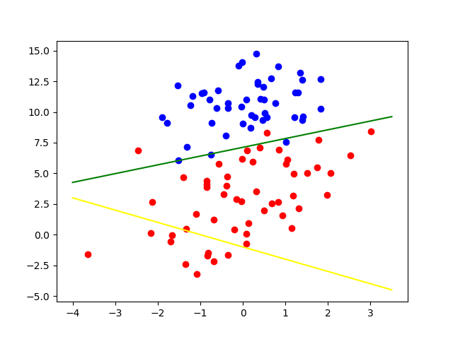
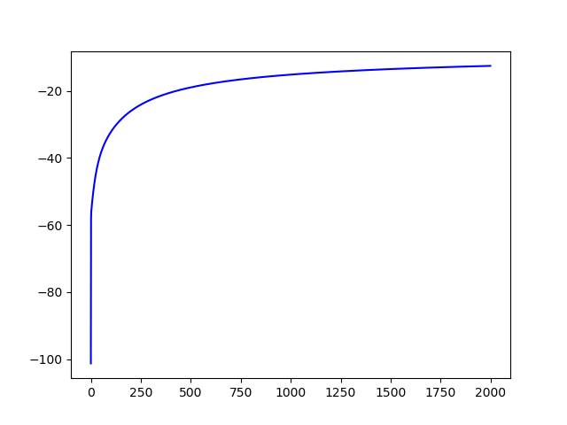

**前言**  
&emsp;&emsp;前面主要是讲反向传播和梯度下降的方法，那么其实涉及梯度的机器学习方法并不是只有深度学习一种，逻辑回归也是可以利用梯度的信息进行参数的更新，使得模型逐步满足我们的数据要求。注意，逻辑回归输出的是属于某一种类别的概率，利用阈值的控制来进行判别，因此逻辑回归本质上是一种**分类方法**。
 <!-- more -->


##### 一、逻辑斯蒂回归

&emsp;&emsp;逻辑斯蒂回归（logistic regression，下面简称逻辑回归），是一种十分经典的分类方法。我们首先介绍一下逻辑回归的定义。  
&emsp;&emsp;假设我们有一个数据集 $S$，一共包含$m$个样本数据，即： $S = \{(x_1,y_1),(x_2,y_2),...,(x_m，y_m)\}$，其中，$y_i \in \{0, 1\}$。为了表示的方便，我们不妨设当$y_i = 1$时为正样本，当$y_i = 0$时为负样本，当然，反过来也是可以的，这个并不重要，只不过一般习惯这样表达。

&emsp;&emsp;在SVM中，我们根据数据集的分布，求解出了一个二分的超平面 $f(x) = \omega \cdot x+b$，现在我们要对一个新的样本点$x_0$进行分类预测，需要将这个样本点带入上面的超平面公式。当$f(x_0) = \omega \cdot x_0 + b > 0$时，我们将这个样本点标记为1，当$f(x_0) = \omega \cdot x_0 + b \leq 0$时，我们将这个样本点标记为-1。观察到SVM只能对新样本输出 $\pm1$，无法较为准确的输出样本属于每一个类别的概率究竟是多少。SVM结果的正确性在于它保证了找到的是样本间隔最大的那个超平面，这样就可以保证以最高的精确度区分新的样本。然而SVM却无法对一个新样本的概率进行求解。而这就是逻辑回归主要做的事情，它输出的是一个概率值，当这个概率值大于一定的阈值时，样本标记为1，反之则标记为0。

##### 二、sigmoid函数

&emsp;&emsp;熟悉深度学习的人肯定对这个函数非常了解，它是早期深度学习网络经常使用的激活函数之一。它的定义公式如下：
$$
sigmoid(x) = \frac{1}{1 + e^{-x}} \quad x \in R
$$
&emsp;&emsp;它的函数图像是一个典型的S型曲线，定义域是全体实数。我们根据公式可以发现，这个函数将全体实数映射到了 $(0, 1)$ 区间上，并在这个区间上单调递增，$x$越大，函数值越大。而这正好符合我们需要的概率分布的规律。

##### 三、逻辑回归模型

&emsp;&emsp;二项逻辑回归模型本质上是一个类似下面公式的条件分布：
$$
P(Y = 1 | x) = \frac{1}{1 + e^{-(\omega \cdot x + b)}} \tag{1}
$$

$$
P(Y = 0 | x) = 1 - \frac{1}{1 + e^{-(\omega \cdot x + b)}} \tag{2}
$$

&emsp;&emsp;其中，第一个式子是我们需要重点关注的。我们对第一个式子右边的分数，上下同时乘以 $e^{\omega \cdot  x + b}$，得到：
$$
P(Y = 1 | x) = \frac{e^{\omega \cdot x + b}}{1 + e^{\omega \cdot x + b}} \tag{3}
$$
&emsp;&emsp;以上就是我们经常可以看到的逻辑回归的公式了。

&emsp;&emsp;现在我们将偏置量也放进参数 $\omega$中，所以变量$x$的尾部会增加一个多余的维度1来和偏置量进行匹配，于是，我们有如下的表示方式：
$$
\omega = \begin{bmatrix} \omega_1 & \omega_2 & \cdots & \omega_n & b\end{bmatrix}
$$

$$
x = \begin{bmatrix} x_1 & x_2 & \cdots & x_n & 1\end{bmatrix}
$$


&emsp;&emsp;于是，原逻辑回归公式可以有以下的表达：
$$
P(Y = 1 | x) = \frac{e^{\omega \cdot x}}{1 + e^{\omega \cdot x}} \tag{4}
$$

##### 四、损失函数

&emsp;&emsp;很容易想到，损失函数我们仍然可以使用前面介绍的差方和的方法计算。当距离目标越近时，差方和越小，损失就会越小。事实上并不能这样进行处理。
$$
J(\omega, b) = \sum_i( \frac{1}{1 + e^{-(\omega \cdot x_i)}} - y_i)^2 = \sum_i (\frac{e^{\omega \cdot x}}{1 + e^{\omega \cdot x}} - y_i) ^2\tag{4}
$$
&emsp;&emsp;原因是如果使用差方和作为最后的损失函数，那么我们得到的最后的损失函数并不是一个简单的凹函数（或者凸函数），这个函数存在许多的局部极小值，因此很难通过梯度下降的方法收敛到全局最小值附近，这样导致的结果就是训练出来的模型并不能很好的满足我们的需要，误差较大。

&emsp;&emsp;所以我们必须要重新定义一个满足我们条件的损失函数，或者称为目标函数。我们考虑使用极大似然估计的方法进行参数估计。

&emsp;&emsp;对于其中的某一个样本，如果该样本的标签为1，那么我们需要极大化$P(Y = 1|x)$，如果该样本的标签为0，那么我们需要极大化$1 - P(Y = 1|x)$，于是对于每一个样本数据，综合来看，我们只需要极大化以下的式子即可：
$$
P(Y = 1|x_i)^{y_i} (1 - P(Y= 1|x_i))^{1 - y_i}
$$
&emsp;&emsp;上面的式子看起来很吓人，其实本质很简单。于是我们的似然函数可以表示为
$$
L(\omega) = \prod_i P(Y = 1|x_i)^{y_i} (1 - P(Y= 1|x_i))^{1 - y_i} \tag{5}
$$
&emsp;&emsp;由于这里涉及指数，而且是连乘运算，计算不方便，于是我们可以用取对数的方式进行处理，这里可以这样处理的原因是上式取最大的时候，其对数也一定是取最大值，因为对数函数是一个单调函数。于是有：
$$
log L(\omega) = \sum_i y_i log(P(Y = 1|x_i)) + (1 - y_i) log(1 - P(Y = 1|x_i)) \tag{6}
$$
&emsp;&emsp;现在我们可以将之前的计算结果带入到公式(6)中进行化简：
$$
\begin{aligned}
logL(\omega) &= \sum_i y_i log(P(Y = 1|x_i)) + (1 - y_i) log(1 - P(Y = 1|x_i)) \\
&= \sum_i y_i log(\frac{e^{\omega \cdot x_i}}{1 + e^{\omega \cdot x_i}}) + (1 - y_i) log(1 - \frac{e^{\omega \cdot x_i}}{1 + e^{\omega \cdot x_i}}) \\
&= \sum_i y_i log(\frac{e^{\omega \cdot x_i}}{1 + e^{\omega \cdot x_i}}) + (1 - y_i) log( \frac{1}{1 + e^{\omega \cdot x_i}}) \\
&= \sum_i y_i log(\frac{e^{\omega \cdot x_i}}{1 + e^{\omega \cdot x_i}}) + log( \frac{1}{1 + e^{\omega \cdot x_i}}) - y_i log(\frac{1}{1 + e^{\omega \cdot x_i}}) \\
&= \sum_i y_i (log(\frac{e^{\omega \cdot x_i}}{1 + e^{\omega \cdot x_i}}) - log(\frac{1}{1 + e^{\omega \cdot x_i}})) + log(\frac{1}{1 + e^{\omega \cdot x_i}}) \\
&= \sum_i y_i log(e^{\omega \cdot x_i}) - log(1 + e^{\omega \cdot x_i}) \\
&= \sum_i y_i \omega \cdot x_i - log(1 + e^{\omega \cdot x_i})
\end{aligned} \tag{7}
$$
&emsp;&emsp;于是我们需要的似然函数就变成了：
$$
logL(\omega) = \sum_i y_i \omega \cdot x_i - log(1 + e^{\omega \cdot x_i}) \tag{8}
$$
&emsp;&emsp;上面的似然函数并不能直接进行最优化求解，于是我们常常利用梯度下降的方法进行逐步迭代求解，这就需要对上面的公式进行求导的操作，我们对参数$\omega$求导如下：
$$
\begin{aligned}
\frac{\partial logL(\omega)}{\partial \omega} &= \sum_i y_i x_i - \frac{1}{1+e^{\omega \cdot x_i}} e^{\omega \cdot x_i} x_i \\
&= \sum_i y_i x_i - \frac{e^{\omega \cdot x_i} x_i}{1+e^{\omega \cdot x_i}} 
\end{aligned} \tag{9}
$$
&emsp;&emsp;以上就是利用梯度下降算法进行逻辑回归问题的求解的（偏）导数计算公式，在每一轮的迭代过程中，我们对所有的样本进行梯度计算，最后累加梯度，然后按照计算出的梯度信息更新需要的参数。

&emsp;&emsp;由于我们这里需要将似然函数极大化，因此和反向传播的梯度下降不同，这里使用的是类似的梯度上升的方法，于是我们有如下的迭代公式：这里的$\alpha$指的是学习率（或者说是步长信息）
$$
\omega := \omega + \alpha \frac{\partial logL(\omega)}{\partial \omega} \tag{10}
$$

##### 五、关于逻辑回归的似然函数  

&emsp;&emsp;在利用不同的方式计算损失函数时，我们总是希望得到的损失函数时一个凸函数（或者凹函数），这样我们就可以保证只有一个全局的最优解，而且不存在局部极小值或者极大值，而这些条件都对我们使用梯度下降方法来求解最优化问题十分有利。如果一个函数的二阶导数总是恒大于0，我们称这个函数为凸函数，如果一个函数的二阶导数总是恒小于0，我们称这个函数为凹函数，凸函数一定存在一个全局最小值，凹函数一定存在一个全局最大值，并且不管是凹函数还是凸函数都不存在局部极小值或者局部最大值。

&emsp;&emsp;我们以$y = x^2$为例，经过计算我们得到它的二阶导数为$y\prime\prime = 2$，是一个大于0的常数，因此该函数是一个凸函数，其不存在各种局部最小值或者局部最大值，只有一个全局最小值0（当然这个全局最小值也可以看作是一个某一个区域内的局部最小值）。

&emsp;&emsp;现在我们重新审视一下我们的似然函数，之前我们已经求解出了似然函数的梯度信息（一阶导数），即：
$$
\frac{\partial logL(\omega)}{\partial \omega} = \sum_i y_i x_i - \frac{e^{\omega \cdot x_i} x_i}{1+e^{\omega \cdot x_i}} \tag{11}
$$
&emsp;&emsp;我们继续对上式进行求导的操作，有：
$$
\begin{aligned} \frac{\partial^2 logL(\omega)}{\partial \omega^2} &= \sum_i - x_i \frac{e^{\omega \cdot x_i} x_i (1 + e^{e^{\omega \cdot x_i}}) - e^{\omega \cdot x_i}(e^{\omega \cdot x_i} x_i)}{(1 + e^{\omega \cdot x_i})^2} \\
&= \sum_i - x_i \frac{e^{\omega \cdot x_i} x_i}{(1 + e^{\omega \cdot x_i})^2} \\
&= \sum_i - \frac{e^{\omega \cdot x_i}}{(1 + e^{\omega \cdot x_i})^2} x_i \cdot x_i 
\end{aligned} \tag{12}
$$
&emsp;&emsp;可以发现的是，上式对于任何的一个数据集合来说都是恒小于0的，因此可以说当我们使用极大似然估计作为损失函数时，该函数是一个凹函数，有一个最大值，可以利用梯度下降（严格来说这个应该是梯度上升的方法）进行求解。

&emsp;&emsp;通常，当我们求解出最终的参数时，可以获得一个超平面。往往我们将逻辑回归的阈值设置为0.5，将输出值高于0.5的样本标记为正样本，将输出值低于0.5的样本标记为负样本，于是，我们可以得到分类的超平面为：
$$
\frac{1}{1 + e^{\omega \cdot x}} = \frac{1}{2} \tag{13}
$$
&emsp;&emsp;化简之后，我们可以得到最终的超平面的表达式为：
$$
\omega \cdot x = 0 \tag{14}
$$


##### 六，代码

&emsp;&emsp;这里的数据使用的是《机器学习实战》的数据，一共有100组数据：

```text
-0.017612	14.053064	0
-1.395634	4.662541	1
-0.752157	6.538620	0
-1.322371	7.152853	0
0.423363	11.054677	0
0.406704	7.067335	1
0.667394	12.741452	0
-2.460150	6.866805	1
0.569411	9.548755	0
-0.026632	10.427743	0
0.850433	6.920334	1
1.347183	13.175500	0
1.176813	3.167020	1
-1.781871	9.097953	0
-0.566606	5.749003	1
0.931635	1.589505	1
-0.024205	6.151823	1
-0.036453	2.690988	1
-0.196949	0.444165	1
1.014459	5.754399	1
1.985298	3.230619	1
-1.693453	-0.557540	1
-0.576525	11.778922	0
-0.346811	-1.678730	1
-2.124484	2.672471	1
1.217916	9.597015	0
-0.733928	9.098687	0
-3.642001	-1.618087	1
0.315985	3.523953	1
1.416614	9.619232	0
-0.386323	3.989286	1
0.556921	8.294984	1
1.224863	11.587360	0
-1.347803	-2.406051	1
1.196604	4.951851	1
0.275221	9.543647	0
0.470575	9.332488	0
-1.889567	9.542662	0
-1.527893	12.150579	0
-1.185247	11.309318	0
-0.445678	3.297303	1
1.042222	6.105155	1
-0.618787	10.320986	0
1.152083	0.548467	1
0.828534	2.676045	1
-1.237728	10.549033	0
-0.683565	-2.166125	1
0.229456	5.921938	1
-0.959885	11.555336	0
0.492911	10.993324	0
0.184992	8.721488	0
-0.355715	10.325976	0
-0.397822	8.058397	0
0.824839	13.730343	0
1.507278	5.027866	1
0.099671	6.835839	1
-0.344008	10.717485	0
1.785928	7.718645	1
-0.918801	11.560217	0
-0.364009	4.747300	1
-0.841722	4.119083	1
0.490426	1.960539	1
-0.007194	9.075792	0
0.356107	12.447863	0
0.342578	12.281162	0
-0.810823	-1.466018	1
2.530777	6.476801	1
1.296683	11.607559	0
0.475487	12.040035	0
-0.783277	11.009725	0
0.074798	11.023650	0
-1.337472	0.468339	1
-0.102781	13.763651	0
-0.147324	2.874846	1
0.518389	9.887035	0
1.015399	7.571882	0
-1.658086	-0.027255	1
1.319944	2.171228	1
2.056216	5.019981	1
-0.851633	4.375691	1
-1.510047	6.061992	0
-1.076637	-3.181888	1
1.821096	10.283990	0
3.010150	8.401766	1
-1.099458	1.688274	1
-0.834872	-1.733869	1
-0.846637	3.849075	1
1.400102	12.628781	0
1.752842	5.468166	1
0.078557	0.059736	1
0.089392	-0.715300	1
1.825662	12.693808	0
0.197445	9.744638	0
0.126117	0.922311	1
-0.679797	1.220530	1
0.677983	2.556666	1
0.761349	10.693862	0
-2.168791	0.143632	1
1.388610	9.341997	0
0.317029	14.739025	0

```

&emsp;&emsp;前两列为数据，最后一列为对应数据的标签。

&emsp;&emsp;代码如下：

```python
import matplotlib.pyplot as plt
import numpy as np


def read_file():
    positive = []
    negative = []

    f = open("testSet.txt", "r")
    for line in f:
        l = line.strip()
        l = l.split("\t")
        l = [float(i) for i in l]
        if l[-1] == 1.0:
            positive.append([l[0], l[1], 1])
        else:
            negative.append([l[0], l[1], 1])
    positive = np.array(positive, dtype=np.float)
    negative = np.array(negative, dtype=np.float)
    return positive, negative

def cost(positive, negative, w):
    c = 0
    for i in positive:
        c += 1.0 * np.sum(np.multiply(w, i)) - np.log(1 + np.exp(np.sum(np.multiply(w, i))))

    for i in negative:
        c += 0.0 * np.sum(np.multiply(w, i)) - np.log(1 + np.exp(np.sum(np.multiply(w, i))))

    return c


def loop():
    positive, negative = read_file()
    w = np.array([1, 1, 1])
    w_copy = w.copy()
    alpha = 0.001
    for i in range(2000):
        print(cost(positive, negative, w))
        gradient = np.array([0., 0., 0.])

        for i in positive:
            gradient += 1.0 * i - (np.exp(np.sum(np.multiply(w, i))) * i) / (1 + np.exp(np.sum(np.multiply(w, i))))

        for i in negative:
            gradient += 0.0 * i - (np.exp(np.sum(np.multiply(w, i))) * i) / (1 + np.exp(np.sum(np.multiply(w, i))))

        w = w + alpha * gradient
    return positive, negative, w, w_copy


if __name__ == '__main__':
    positive, negative, w, w_origin = loop()
    plt.scatter(positive[:, 0], positive[:, 1], c="red")
    plt.scatter(negative[:, 0], negative[:, 1], c='blue')
    xs = np.linspace(-4, 3.5, 300)
    ys1 = (w[0] * xs + w[2]) / (- w[1])
    ys2 = (w_origin[0] * xs + w_origin[2]) / (- w_origin[1])

    plt.plot(xs, ys1, c="green")
    plt.plot(xs, ys2, c="yellow")
    plt.show()
```

&emsp;&emsp;代码运行结果如下，其中黄色直线表示的是初始的分隔超平面，绿色的直线表示为分类超平面，可以看出，样本数据可以较好地被分隔开，第二幅图表示的是梯度上升的情况，可以看到，算法可以较好地收敛于全局最优解附近：

