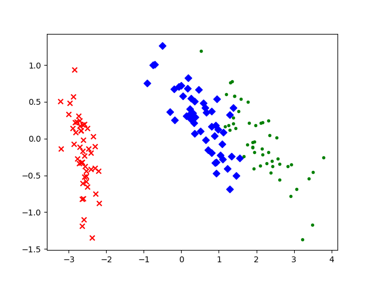

##### 数据降维

&emsp;&emsp;在很多时候，我们收集的数据样本的维度很多，而且有些维度之间存在某一些联系，比如，当我们想要收集用户的消费情况时，用户的收入和用户的食物支出往往存在一些联系，收入越高往往食物的支出也越高（这里只是举个例子，不一定正确。）。那么在拿到这样的数据的时候，我们首先想到的就是我们需要对其中的信息做一些处理，排除掉一些冗余的维度，保留必要的维度信息。这样一来，我们可以大大减小我们的后期处理的工作量，这就是数据降维的基本要求。
<!--more-->


##### 主成分分析PCA

&emsp;&emsp;当拿到用户的数据时，如何确定到两个维度之间是否存在联系呢？这个就是我们需要用的协方差矩阵所作的工作。所以在使用PCA之前，我们必须对协方差有个简单的了解。

###### 方差和协方差

&emsp;&emsp;我们之前遇到的大多数情况是获取到的都是一维的数据，比如数学课程的考试成绩，每个人都能获得一个分数，这些分数形成了一个一维的数组（向量），如果我们用 $X$ 表示考试成绩的分布，然后我们可以估计出数学课程的考试成绩的均值 $\bar{X}$ 和方差 $S^2$，如下：
$$
\bar{X} = \frac{1}{N} \sum_{i = 1}^{N} X_i \tag{1}
$$

$$
S^2 = \frac{1}{N - 1} \sum_{i = 1}^{N} (X_i - \bar{X}) ^2 \tag{2}
$$

&emsp;&emsp;需要注意的是在求解方差的时候，我们使用的分母是 $N- 1$，而不是 $N$，这是因为我们以上的数学成绩对真实成绩分布的一次简单抽样，为了获得更为准确的关于原分布的方差估计，我们必须使用这种所谓的“无偏估计”。

&emsp;&emsp;以上都是关于单一变量的方差估计，通常，我们记单变量的方差为 $var(X)$，于是我们有:
$$
var(X) = S^2 =  \frac{1}{N - 1} \sum_{i = 1}^{N} (X_i - \bar{X}) ^2 \tag{3}
$$
&emsp;&emsp;但是考虑到更普遍的情况，我们不止有数学考试（X），我们还有物理考试（Y），英语考试（Z），我们就需要考虑一个问题，不同的考试的成绩之间是否存在某种联系，于是我们就利用协方差来定义两个随机变量之间的关系。现在我们有两个随机变量，$X$ 和 $Y$的抽样数据分布，我们将他们之间的协方差定义如下：
$$
cov(X, Y) = \frac{1}{N - 1} \sum_{i = 1}^{N} (X_i - \bar{X})(Y_i - \bar{Y}) \tag{4}
$$
&emsp;&emsp;很明显，这里的分母依然采用的是 $N - 1$，是对原分布的无偏估计。对于只有一个变量的情况，我们有：
$$
cov(X, X) = \frac{1}{N - 1} \sum_{i = 1}^{N} (X_i - \bar{X})(X_i - \bar{X}) = \frac{1}{N - 1} \sum_{i = 1}^{N} (X_i - \bar{X})^2 = var(X) \tag{5}
$$
&emsp;&emsp;所以方差算是协方差的一个特例。**协方差本质上是对两个随机变量的相关性的考察，当两个随机变量之间的协方差大于0时，表示这两个随机变量正相关；当两个随机变量之间的协方差等于0时，表示这两个随机变量没有相关关系；当两个随机变量之间的协方差小于0时，表示这两个随机变量负相关。**

&emsp;&emsp;需要注意的是，两个随机变量相互独立和两个随机变量不相关是两个不同的概念，两个随机变量独立则一定有这两个随机变量不相关，但是两个随机变量不相关并不一定有这两个随机变量相互独立。

###### 协方差矩阵

&emsp;&emsp;假设我们现在有一张数据统计的表格，每一列的数据都已经**去中心化**，即每一列的数据都已经减去了该列的均值。如下：

| No.  | $X_1$    | $X_2$    | ...  | $X_m$    |
| ---- | -------- | -------- | ---- | -------- |
| 1    | $a_{11}$ | $a_{12}$ | ...  | $a_{1m}$ |
| 2    | $a_{21}$ | $a_{22}$ | ...  | $a_{2m}$ |
| ...  | ...      | ...      | ...  | ...      |
| n    | $a_{n1}$ | $a_{n2}$ | ...  | $a_{nm}$ |

&emsp;&emsp;一共有 $n$ 个样本数据，每个样本数据包括 $m$ 个统计信息。对于每一列，都是一个随机变量的简单抽样，不妨我们将上面的矩阵记作 $X$，于是，我们有：
$$
X =
\begin{bmatrix}
a_{11} & a_{12} & \cdots & a_{1m} \\
a_{21} & a_{22} & \cdots & a_{2m} \\
\vdots & \vdots & \ddots & \vdots \\
a_{n1} & a_{n2} & \cdots & a_{nm}
\end{bmatrix}
= \begin{bmatrix}
c_{1} & c_{2} & \cdots & c_{m}
\end{bmatrix} \tag{6}
$$
&emsp;&emsp;其中， $c_i$ 表示的是每一个随机变量的取值分布情况，那么，第 $i$ 个随机变量和第 $j$ 个随机变量之间的协方差就可以表示为：
$$
cov(c_i, c_j) = \frac{1}{n-1} c_i \cdot c_j = \frac{1}{n - 1} \sum_{k = 1}^{n} a_{ki} a_{kj} \tag{7}
$$
&emsp;&emsp;那么每两个随机变量之间的协方差矩阵（不妨叫做 $CovMatrix$ ）可以表示如下：
$$
\begin{aligned}
CovMatrix &= \begin{bmatrix}
cov(c_1, c_1) & cov(c_1, c_2) & \cdots & cov(c_1, c_m) \\
cov(c_2, c_1) & cov(c_2, c_2) & \cdots & cov(c_2, c_m) \\
\vdots & \vdots & \ddots & \vdots \\
cov(c_m, c_1) & cov(c_m, c_2) & \cdots & cov(c_m, c_m) \\
\end{bmatrix} \\
&= \begin{bmatrix}
\frac{1}{n - 1} \sum_{k = 1}^{n} a_{k1} a_{k1} & \frac{1}{n - 1} \sum_{k = 1}^{n} a_{k1} a_{k2}& \cdots & \frac{1}{n - 1} \sum_{k = 1}^{n} a_{k1} a_{km} \\
\frac{1}{n - 1} \sum_{k = 1}^{n} a_{k2} a_{k1} & \frac{1}{n - 1} \sum_{k = 1}^{n} a_{k2} a_{k2}& \cdots & \frac{1}{n - 1} \sum_{k = 1}^{n} a_{k2} a_{km} \\
\vdots & \vdots & \ddots & \vdots \\
\frac{1}{n - 1} \sum_{k = 1}^{n} a_{km} a_{k1} & \frac{1}{n - 1} \sum_{k = 1}^{n} a_{km} a_{k2}& \cdots & \frac{1}{n - 1} \sum_{k = 1}^{n} a_{km} a_{km} \\
\end{bmatrix} \\
&= \frac{1}{n - 1} \begin{bmatrix}
 \sum_{k = 1}^{n} a_{k1} a_{k1} &  \sum_{k = 1}^{n} a_{k1} a_{k2}& \cdots &  \sum_{k = 1}^{n} a_{k1} a_{km} \\
 \sum_{k = 1}^{n} a_{k2} a_{k1} &  \sum_{k = 1}^{n} a_{k2} a_{k2}& \cdots &  \sum_{k = 1}^{n} a_{k2} a_{km} \\
\vdots & \vdots & \ddots & \vdots \\
 \sum_{k = 1}^{n} a_{km} a_{k1} &  \sum_{k = 1}^{n} a_{km} a_{k2}& \cdots &  \sum_{k = 1}^{n} a_{km} a_{km} \\
\end{bmatrix} \\
&= \frac{1}{n - 1} \begin{bmatrix}
 a_{11} & a_{21} & \cdots & a_{n1} \\
 a_{12} & a_{22} & \cdots & a_{n2} \\
\vdots & \vdots & \ddots & \vdots \\
 a_{1m} & a_{2m} & \cdots & a_{nm} \\
\end{bmatrix} \begin{bmatrix}
 a_{11} & a_{12} & \cdots & a_{1m} \\
 a_{21} & a_{22} & \cdots & a_{2m} \\
\vdots & \vdots & \ddots & \vdots \\
 a_{n1} & a_{n2} & \cdots & a_{nm} \\
\end{bmatrix} \\
&= \frac{1}{n - 1} X^T X 
\end{aligned} \tag{8}
$$
&emsp;&emsp;故，对于上述的矩阵 $X$ ，我们可以求得它的协方差矩阵为：
$$
CovMatrix = \frac{1}{n - 1} X^T X \tag{10}
$$
&emsp;&emsp;其中，$n$ 为样本数目，$X^T$ 表示矩阵 $X$ 的转置。  
&emsp;&emsp;在处理表格时，我们已经先做了去中心化的操作，目的是使得协方差公式中的 $\bar{X}$ 为0，这样的话可以直接进行矩阵的相乘，不必在求解协方差的时候一个一个去计算。

###### 特征值和特征向量

&emsp;&emsp;在很多时候，我们需要对一个矩阵求解它的特征值和特征向量，特征值和特征向量的定义是，对于一个对称方阵 $A$ ，如果存在一个值 $\lambda$ 和一个向量 $x$ 满足如下的条件：
$$
Ax = \lambda x \tag{11}
$$
&emsp;&emsp;那么我们就将 $\lambda$ 称为该矩阵的特征值，对应的 $x$ 则称之为特征向量。  
&emsp;&emsp;根据线性代数的相关知识，我们可以知道，对于一个实对称矩阵 $A$，一定存在 $n$ 个相正交的特征向量，其中 $n$ 为该矩阵的行数（或者说列数）。那么如果我们将对称矩阵的特征值按照从大到小的顺序进行排列，同时，我们对特征向量也按照其对应特征值的大小进行排列，于是，我们有如下的排列：
$$
\lambda_1, \lambda_2, \cdots, \lambda_n \\
x_1, x_2, \cdots, x_n
$$
&emsp;&emsp;对于上面的每一对特征值和特征向量，我们都能满足等式(11)。于是，我们可以将所有的特征向量组合成一个矩阵，记作 $W$，将所有的特征值依次放入一个 $n$ 阶的全零方阵的对角线元素中，记作 $\Sigma$，于是，我们可以获得下面的等式：
$$
AW = W\Sigma \tag{12}
$$
&emsp;&emsp;在上面的式子右边同时乘以 $W^{-1}$ ，有：
$$
A = W \Sigma W^{-1} \tag{13}
$$
&emsp;&emsp;现在我们发现对于矩阵 $W$ ，我们可以得到下面的式子：
$$
W W^T = E \tag{14}
$$
&emsp;&emsp;有以上式子的原因是因为我们对所有的特征向量进行了规范化，使得所有的特征向量模长为1，而且由于$A$是实对称矩阵，所以$A$的特征向量两两正交，所以有以下的两个式子：
$$
\lambda_i \cdot \lambda_i = 1 \\
\lambda_i \cdot \lambda_j = 0, \quad i \ne j \tag{15}
$$
&emsp;&emsp;由公式(14)，我们就可以得到：
$$
W^T = W^{-1} \tag{16}
$$
&emsp;&emsp;故，我们重写式(13)，有：
$$
A = W \Sigma W^T \tag{17}
$$
&emsp;&emsp;需要注意的是，上述的公式需要满足的条件是 $A$是一个实对称方矩。

###### 主成分分析

&emsp;&emsp;很明显，我们需要对原始的数据进行处理，我们希望是**两个不同的数据维度之间的相关性越小越好，而同一个维度内部的方差越大越好**，因为只有这样，我们才有很好的排除数据维度的相关性并进行数据的降维操作。我们这里设$Y$是经过我们变换之后的数据矩阵，那么我们的要求就是$Y$的协方差矩阵是一个对角矩阵，其中所有的非对角线上的元素都是0，而在对角线上的元素是可以为非0的。同时，我们可以设矩阵$P$是一组线性变换的相互正交的单位基，按照列进行排列。那么对于原始的数据矩阵，我们可以有：
$$
Y = XP \tag{18}
$$
&emsp;&emsp;上面的式子表示的是$X$矩阵映射到以矩阵$P$为基的线性变换。我们假设原始数据$X$的协方差矩阵为$B$，经过变化之后的数据$Y$的协方差矩阵为$D$，那么我们可以有：
$$
\begin{aligned}
D &= \frac{1}{n - 1}Y^T Y \\
&= \frac{1}{n - 1}(XP)^T (XP) \\
&= \frac{1}{n - 1}P^T X^T XP \\
&=\frac{1}{n - 1}P^T (X^T X) P \\
&= P^T (\frac{1}{n - 1}X^T X) P \\
&= P^T B P 
\end{aligned} \tag{19}
$$
&emsp;&emsp;从上面的式子中我们不难发现，我们需要找的是这样的一种变换，$D$是一个对角矩阵，不妨这里假设对角矩阵$D$的对角线上的元素是从大到小排列的，$B$是原始数据矩阵的协方差矩阵，因此，我们需要的找到的变换$P$可以将$B$映射成对角矩阵$D$。  

&emsp;&emsp;此时，我们考虑到对于一个实对称矩阵$A$，我们有$A = W \Sigma W^T$，其中，$\Sigma$是矩阵$A$的特征值组成的对角矩阵，$W$是矩阵$A$的特征向量按照对应特征值的排列组成的特征向量矩阵，所以，结合上面的推导，我们不难发现，$D$矩阵就可以对应于这里的$\Sigma$矩阵，$W$矩阵就可以对应于我们问题中的$P$矩阵。  
$$
D = P^T B P \\
(P^T)^{-1}DP^{-1} = B \\
$$
&emsp;&emsp;考虑到$P$矩阵是由一组正交单位基组成的，所以满足：
$$
P^T P = E
$$
&emsp;&emsp;所以有：
$$
P^T = P^{-1}
$$
&emsp;&emsp;代入上面的式子，我们有：
$$
(P^T)^{-1}DP^{-1} = P D P^T = B
$$
&emsp;&emsp;我们可以发现，我们需要的变换矩阵$P$就是由$B$的特征向量组成的。因此，问题就转换成了求解$B$的特征值和特征向量，而$B$又是原始矩阵$X$的协方差矩阵。  
&emsp;&emsp;**由于我们这里主要关心的是维度之间的相关性的大小，而且在后面的处理中，我们需要求解协方差矩阵的特征向量，所以我们可以将求解协方差矩阵的系数省略。** 在后面的代码中，我们就直接省略了协方差矩阵的前系数，进一步简化了计算。

###### 数据降维  

&emsp;&emsp;在前面的式子中，我们并没有对数据的维度进行操作，即我们保留了所有的数据维度，但是并不是所有的数据维度都是足够必要的。由于矩阵的特征值往往会有比较大的差距，当我们求解出了原始数据的协方差矩阵的特征值和特征向量之后，我们可以舍弃掉太小的特征值以及对应的特征向量，这是因为特征值太小，转换之后的对应的数据维度的方差就会很小，也就是说该维度数据之间的差距不大，不能帮我们很好的区分数据之间的差别，舍弃之后也不会丢失太多的信息，舍弃之后反而可以减小数据的维度信息，更好的节省数据的占用空间，这对于一些大量数据的处理是十分有益的。  

&emsp;&emsp;我们求出原始数据矩阵的协方差矩阵的特征值和特征向量之后，我们将特征向量进行从大到小进行排序，并按照特征值的顺序将特征向量进行排序。我们可以取前$K$个特征值和特征向量，并将这些向量组合成一个变换矩阵。将这个变换矩阵应用到原始数据矩阵上即可对原始数据进行降维。这里的$K$按照任务的要求可以有不同的取值。还有一种选取特征值的方法就是选取前$K$个特征值，这些特征值之和占全部特征值之和的90%或者95%以上。  

##### PCA实例  

&emsp;&emsp;接下来就是一个PCA的实例，在sklearn的python包中，有一个鸢尾花数据集，包括了150组鸢尾花的数据，分为三类，每一组数据包含四个数据维度，我们的目标就是将这个数据集的数据维度减少到两维以便我们可以在二维平面上进行绘制。  

&emsp;&emsp;这里使用了numpy自带的特征值和特征向量的求解函数，代码如下：  

```python
import matplotlib.pyplot as plt
from sklearn.datasets import load_iris
import numpy as np


def load_data():
    data = load_iris()
    y = data.target
    x = data.data
    return x, y


def pca(x, dimensions=2):
    x = np.array(x)
    assert len(x.shape) == 2, "The data must have two dimensions."
    # 求解协方差矩阵
    matrix = np.matmul(np.transpose(x), x)

    # 求解特征值和特征向量
    values, vectors = np.linalg.eig(matrix)

    # 按照从大到小的顺序给特征值排序
    index = np.argsort(values)[::-1]
    
    # 选取前几个特征值较大的特征向量，并组成一个变换矩阵
    vectors = vectors[:, index[:dimensions]]

    # 应用变换矩阵，将原始数据进行映射
    x_dimension_reduction = np.matmul(x, vectors)
    return x_dimension_reduction


def draw(x, y):
    red_x, red_y = [], []
    blue_x, blue_y = [], []
    green_x, green_y = [], []

    for i in range(len(x)):
        if y[i] == 0:
            red_x.append(x[i][0])
            red_y.append(x[i][1])
        elif y[i] == 1:
            blue_x.append(x[i][0])
            blue_y.append(x[i][1])
        else:
            green_x.append(x[i][0])
            green_y.append(x[i][1])

    plt.scatter(red_x, red_y, c='r', marker='x')
    plt.scatter(blue_x, blue_y, c='b', marker='D')
    plt.scatter(green_x, green_y, c='g', marker='.')
    plt.show()


if __name__ == '__main__':
    x, y = load_data()
    # 去中心化
    x = x - np.mean(x, 0)

    x_dimension_reduction = pca(x, 2)
    draw(x_dimension_reduction, y)


```


&emsp;&emsp;结果如下。可以看到，数据被较好地区分开了，其中一组数据已经完全和其他的两组数据脱离，另外两组数据也有了明显的分隔界限。这证明我们的PCA方法是正确的。

